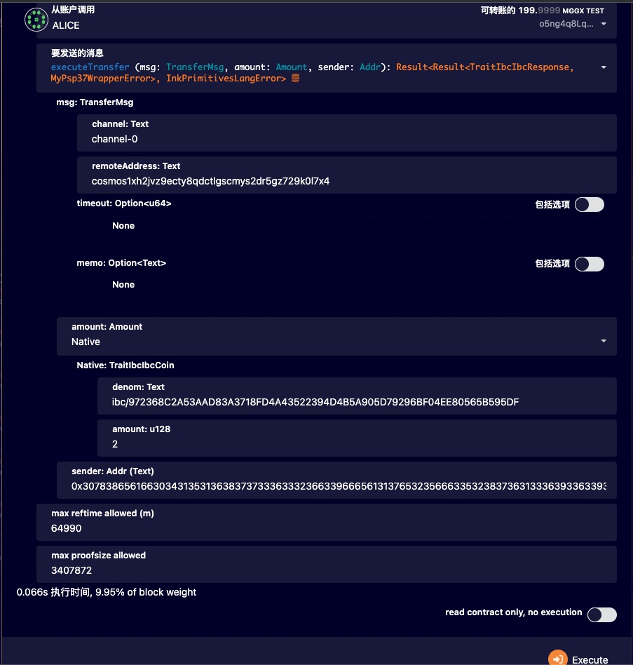

# ICF M3 deliverable

## Related Repos

| Repo Name | Branch | Note |
| --- | --- | --- |
| Hermes | https://github.com/ibc-test/hermes/tree/icf-m3 | relayer |
|  |  |  |
| substrate-ibc | https://github.com/ibc-test/substrate-ibc/tree/icf-m3 | based on ibc-rs 0.28 |
| ggx | https://github.com/GoldenGateGGX/golden-gate/tree/icf-m3 | demo chain |
|  |  |  |
| ibc-go | https://github.com/ibc-test/ibc-go/tree/icf-m3 | include ics10 grandpa light client |
| oct-planet | https://github.com/ibc-test/oct-planet/tree/icf-m3 | demo chain |
|  |  |  |

### pre-requisites

rust 1.69 +

go 1.19+

python 3.10+

[ignite latest](https://ignite.com/)

## spin up substrate/polkadot

```bash
# Clone golden-gate
git clone https://github.com/GoldenGateGGX/golden-gate.git
cd golden-gate
git checkout ibc-ink-extension-runtime

# build golden-gate 
cargo build --release --no-default-features --features="aura,with-rocksdb-weights,testnet"
# optional put polkadot cli into your BIN PATH
export PATH="$PWD/./target/release/:$PATH"

./target/release/golden-gate-node  --dev --ws-external --rpc-external --unsafe-ws-external --unsafe-rpc-external --rpc-methods=unsafe -d ./data -l info --enable-offchain-indexing=true -lpallet_ibc=trace -lpallet-ics20-transfer=trace --detailed-log-output

```

## spin up cosmos chain

```bash
# clone Octopus ignite chain: oct-planet
git clone https://github.com/ibc-test/oct-planet.git

git checkout icf-m3

# launch a cosmos chain: earth 
ignite chain serve -f -v -c earth.yml

```

## compile and config hermes

```bash
$ git clone https://github.com/ibc-test/hermes.git
$ cd hermes
$ git checkout icf-m3

# build
$ cargo build -p ibc-relayer-cli
# check hermes version
$ ./target/debug/hermes version

# optional,export PATH
# export PATH="$PWD/./target/release/:$PATH"
export PATH="$PWD/./target/debug/:$PATH"

# add key
hermes --config config/cos_sub.toml keys add --chain earth-0 --key-file config/alice_cosmos_key.json --key-name alice
hermes --config config/cos_sub.toml keys add --chain rococo-0 --key-file config/bob_substrate_key.json --key-name Bob

```
```bash
li@liyihangs-MBP hermes % hermes --config config/cos_sub.toml keys add --chain earth-0 --key-file config/alice_cosmos_key.json --key-name alice
2023-06-13T11:59:12.139917Z  INFO ThreadId(01) running Hermes v1.3.0+cb38eadb
SUCCESS Added key 'alice' (cosmos1xh2jvz9ecty8qdctlgscmys2dr5gz729k0l7x4) on chain earth-0
li@liyihangs-MBP hermes % 
li@liyihangs-MBP hermes % hermes --config config/cos_sub.toml keys add --chain rococo-0 --key-file config/bob_substrate_key.json --key-name Bob
2023-06-13T11:59:20.090497Z  INFO ThreadId(01) running Hermes v1.3.0+cb38eadb
2023-06-13T11:59:20.090900Z DEBUG ThreadId(01) 🐙🐙 ics10::sr25519_key_pair -> from_key_file key_file: KeyFile { name: "Bob", type: "substrate", address: "5FHneW46xGXgs5mUiveU4sbTyGBzmstUspZC92UhjJM694ty", pubkey: "0x8eaf04151687736326c9fea17e25fc5287613693c912909cb226aa4794f26a48", mnemonic: "bottom drive obey lake curtain smoke basket hold race lonely fit walk//Bob" }
SUCCESS Added key 'Bob' (0x8eaf04151687736326c9fea17e25fc5287613693c912909cb226aa4794f26a48) on chain rococo-0
```

## Test


# create channel
```bash

cd hermes
## may cost few minutes
hermes --config config/cos_sub.toml create channel --a-chain earth-0 --b-chain rococo-0 --a-port transfer --b-port transfer --new-client-connection --yes
```
```bash
 li@liyihangs-MBP hermes % hermes --config config/cos_sub.toml create channel --a-chain earth-0 --b-chain rococo-0 --a-port transfer --b-port transfer --new-client-connection --yes
2023-06-26T07:14:33.778994Z  INFO ThreadId(01) running Hermes v1.3.0+cdcb3804c
2023-06-26T07:14:33.914664Z  INFO ThreadId(01) Creating new clients, new connection, and a new channel with order ORDER_UNORDERED
2023-06-26T07:14:35.596410Z DEBUG ThreadId(20) foreign_client.create{client=rococo-0->earth-0:07-tendermint-0}: 🐙🐙 ics10::substrate::build_consensus_state -> consensus_state ConsensusState { timestamp: Time(2023-06-26 7:14:30.005), root: CommitmentRoot("33D454CC623A9B3F385CC6E7BA61E8C515520A1A5897A938BC8656239E568E10") }
2023-06-26T07:14:35.637383Z DEBUG ThreadId(10) foreign_client.create{client=rococo-0->earth-0:07-tendermint-0}:send_messages_and_wait_commit{chain=earth-0 tracking_id=create client}: sending 1 messages as 1 batches to chain earth-0 in parallel
2023-06-26T07:14:35.638049Z DEBUG ThreadId(10) foreign_client.create{client=rococo-0->earth-0:07-tendermint-0}:send_messages_and_wait_commit{chain=earth-0 tracking_id=create client}:send_tx_with_account_sequence_retry{chain=earth-0 account.sequence=1}: max fee, for use in tx simulation: Fee { amount: "100001stake", gas_limit: 10000000 }
2023-06-26T07:14:35.664601Z DEBUG ThreadId(10) foreign_client.create{client=rococo-0->earth-0:07-tendermint-0}:send_messages_and_wait_commit{chain=earth-0 tracking_id=create client}:send_tx_with_account_sequence_retry{chain=earth-0 account.sequence=1}:estimate_gas: tx simulation successful, gas amount used: 93889
2023-06-26T07:14:35.664836Z DEBUG ThreadId(10) foreign_client.create{client=rococo-0->earth-0:07-tendermint-0}:send_messages_and_wait_commit{chain=earth-0 tracking_id=create client}:send_tx_with_account_sequence_retry{chain=earth-0 account.sequence=1}: send_tx: using 93889 gas, fee Fee { amount: "1033stake", gas_limit: 103277 } id=earth-0
2023-06-26T07:14:35.693209Z DEBUG ThreadId(10) foreign_client.create{client=rococo-0->earth-0:07-tendermint-0}:send_messages_and_wait_commit{chain=earth-0 tracking_id=create client}:send_tx_with_account_sequence_retry{chain=earth-0 account.sequence=1}: gas estimation succeeded
2023-06-26T07:14:35.693331Z DEBUG ThreadId(10) foreign_client.create{client=rococo-0->earth-0:07-tendermint-0}:send_messages_and_wait_commit{chain=earth-0 tracking_id=create client}:send_tx_with_account_sequence_retry{chain=earth-0 account.sequence=1}: tx was successfully broadcasted, increasing account sequence number response=Response { code: Ok, data: b"", log: "[]", hash: Hash::Sha256(1E9442E681D858C93284573541A93C0A21DDD997A433AE461AB962E73626D760) } account.sequence.old=1 account.sequence.new=2
2023-06-26T07:14:35.694693Z DEBUG ThreadId(10) foreign_client.create{client=rococo-0->earth-0:07-tendermint-0}:send_messages_and_wait_commit{chain=earth-0 tracking_id=create client}: wait_for_block_commits: waiting for commit of tx hashes(s) 1E9442E681D858C93284573541A93C0A21DDD997A433AE461AB962E73626D760 id=earth-0
2023-06-26T07:14:36.607177Z  INFO ThreadId(01) foreign_client.create{client=rococo-0->earth-0:07-tendermint-0}: 🍭 client was created successfully id=10-grandpa-0
2023-06-26T07:14:36.607214Z DEBUG ThreadId(01) foreign_client.create{client=rococo-0->earth-0:07-tendermint-0}: event emitted after creation id=10-grandpa-0 event_with_height.event=CreateClient(CreateClient(Attributes { client_id: ClientId("10-grandpa-0"), client_type: Grandpa, consensus_height: Height { revision: 0, height: 551 } }))
2023-06-26T07:14:36.607730Z DEBUG ThreadId(20) foreign_client.create{client=earth-0->rococo-0:07-tendermint-0}: 🐙🐙 ics10::substrate -> get_signer key_pair: Sr25519KeyPair { network_id: "substrate", account_id: "0x8eaf04151687736326c9fea17e25fc5287613693c912909cb226aa4794f26a48", address: "5FHneW46xGXgs5mUiveU4sbTyGBzmstUspZC92UhjJM694ty", public_key: "0x8eaf04151687736326c9fea17e25fc5287613693c912909cb226aa4794f26a48", seed: "bottom drive obey lake curtain smoke basket hold race lonely fit walk//Bob" }
2023-06-26T07:14:36.607759Z DEBUG ThreadId(20) foreign_client.create{client=earth-0->rococo-0:07-tendermint-0}: 🐙🐙 ics10::substrate -> get_signer signer: Signer("0x8eaf04151687736326c9fea17e25fc5287613693c912909cb226aa4794f26a48")
2023-06-26T07:14:43.599072Z DEBUG ThreadId(20) foreign_client.create{client=earth-0->rococo-0:07-tendermint-0}:do_send_messages_and_wait_commit{chain=rococo-0 tracking_id=create client}: 🐙🐙 ics10::substrate -> do_send_messages_and_wait_commit deliver event_with_height : [IbcEventWithHeight { event: CreateClient(CreateClient(Attributes { client_id: ClientId("07-tendermint-0"), client_type: Tendermint, consensus_height: Height { revision: 0, height: 68 } })), height: Height { revision: 0, height: 555 } }]
2023-06-26T07:14:43.599172Z  INFO ThreadId(01) foreign_client.create{client=earth-0->rococo-0:07-tendermint-0}: 🍭 client was created successfully id=07-tendermint-0
2023-06-26T07:14:43.599192Z DEBUG ThreadId(01) foreign_client.create{client=earth-0->rococo-0:07-tendermint-0}: event emitted after creation id=07-tendermint-0 event_with_height.event=CreateClient(CreateClient(Attributes { client_id: ClientId("07-tendermint-0"), client_type: Tendermint, consensus_height: Height { revision: 0, height: 68 } }))
2023-06-26T07:14:43.600613Z DEBUG ThreadId(01) do_conn_open_handshake with connection end states: UNINITIALIZED, UNINITIALIZED
2023-06-26T07:14:43.603084Z DEBUG ThreadId(10) send_messages_and_wait_commit{chain=earth-0 tracking_id=ConnectionOpenInit}: sending 1 messages as 1 batches to chain earth-0 in parallel
2023-06-26T07:14:43.603134Z DEBUG ThreadId(10) send_messages_and_wait_commit{chain=earth-0 tracking_id=ConnectionOpenInit}:send_tx_with_account_sequence_retry{chain=earth-0 account.sequence=2}: max fee, for use in tx simulation: Fee { amount: "100001stake", gas_limit: 10000000 }
2023-06-26T07:14:43.636470Z DEBUG ThreadId(10) send_messages_and_wait_commit{chain=earth-0 tracking_id=ConnectionOpenInit}:send_tx_with_account_sequence_retry{chain=earth-0 account.sequence=2}:estimate_gas: tx simulation successful, gas amount used: 77029
2023-06-26T07:14:43.636678Z DEBUG ThreadId(10) send_messages_and_wait_commit{chain=earth-0 tracking_id=ConnectionOpenInit}:send_tx_with_account_sequence_retry{chain=earth-0 account.sequence=2}: send_tx: using 77029 gas, fee Fee { amount: "848stake", gas_limit: 84731 } id=earth-0
2023-06-26T07:14:43.638190Z DEBUG ThreadId(10) send_messages_and_wait_commit{chain=earth-0 tracking_id=ConnectionOpenInit}:send_tx_with_account_sequence_retry{chain=earth-0 account.sequence=2}: gas estimation succeeded
2023-06-26T07:14:43.638219Z DEBUG ThreadId(10) send_messages_and_wait_commit{chain=earth-0 tracking_id=ConnectionOpenInit}:send_tx_with_account_sequence_retry{chain=earth-0 account.sequence=2}: tx was successfully broadcasted, increasing account sequence number response=Response { code: Ok, data: b"", log: "[]", hash: Hash::Sha256(5FF855FB0A0E4A1E43546F139F372BA17D5A418D8F47441386E2904A6888A06E) } account.sequence.old=2 account.sequence.new=3
2023-06-26T07:14:43.638290Z DEBUG ThreadId(10) send_messages_and_wait_commit{chain=earth-0 tracking_id=ConnectionOpenInit}: wait_for_block_commits: waiting for commit of tx hashes(s) 5FF855FB0A0E4A1E43546F139F372BA17D5A418D8F47441386E2904A6888A06E id=earth-0
2023-06-26T07:14:44.846063Z  INFO ThreadId(01) 🥂 earth-0 => OpenInitConnection(OpenInit { Attributes { connection_id: connection-0, client_id: 10-grandpa-0, counterparty_connection_id: None, counterparty_client_id: 07-tendermint-0 } }) at height 0-76
2023-06-26T07:14:47.881834Z DEBUG ThreadId(01) do_conn_open_handshake with connection end states: INIT, UNINITIALIZED
2023-06-26T07:14:47.893829Z DEBUG ThreadId(01) substrate::connection -> build_conn_try src_connection: ConnectionEnd { state: Init, client_id: ClientId("10-grandpa-0"), counterparty: Counterparty { client_id: ClientId("07-tendermint-0"), connection_id: None, prefix: ibc }, versions: [Version { identifier: "1", features: ["ORDER_ORDERED", "ORDER_UNORDERED"] }], delay_period: 0ns }
2023-06-26T07:14:47.896936Z DEBUG ThreadId(01) foreign_client.wait_and_build_update_client_with_trusted{client=rococo-0->earth-0:10-grandpa-0 target_height=0-557}: 🐙🐙 ics10::foreign_client -> wait_and_build_update_client_with_trusted src_latest_height: Height { revision: 0, height: 557 } >= target_height:Height { revision: 0, height: 557 }
2023-06-26T07:14:47.910891Z DEBUG ThreadId(20) foreign_client.wait_and_build_update_client_with_trusted{client=rococo-0->earth-0:10-grandpa-0 target_height=0-557}:foreign_client.build_update_client_with_trusted{client=rococo-0->earth-0:10-grandpa-0 target_height=0-557}: 🐙🐙 ics10::substrate::build_header -> grandpa_client_state.latest_beefy_height:551 < target_height 557, need to update beefy
2023-06-26T07:14:51.612707Z DEBUG ThreadId(20) foreign_client.wait_and_build_update_client_with_trusted{client=rococo-0->earth-0:10-grandpa-0 target_height=0-557}:foreign_client.build_update_client_with_trusted{client=rococo-0->earth-0:10-grandpa-0 target_height=0-557}: 🐙🐙 ics10::substrate::build_header -> recv raw_signed_commitment: Bytes([1, 4, 109, 104, 128, 152, 77, 28, 231, 244, 74, 47, 88, 133, 75, 39, 180, 151, 123, 19, 50, 32, 7, 236, 204, 166, 252, 93, 206, 76, 206, 4, 135, 130, 60, 114, 150, 47, 2, 0, 0, 0, 0, 0, 0, 0, 0, 0, 0, 4, 128, 1, 0, 0, 0, 4, 85, 131, 186, 50, 64, 102, 80, 240, 188, 121, 85, 102, 201, 195, 55, 40, 52, 42, 162, 36, 114, 85, 248, 103, 150, 14, 229, 246, 158, 168, 12, 177, 110, 145, 40, 38, 38, 32, 156, 245, 168, 7, 47, 142, 249, 236, 61, 217, 144, 6, 233, 173, 230, 202, 83, 121, 171, 67, 140, 47, 34, 179, 163, 59, 0])
2023-06-26T07:14:51.622534Z DEBUG ThreadId(01) foreign_client.wait_and_build_update_client_with_trusted{client=rococo-0->earth-0:10-grandpa-0 target_height=0-557}:foreign_client.build_update_client_with_trusted{client=rococo-0->earth-0:10-grandpa-0 target_height=0-557}: building a MsgUpdateAnyClient from trusted height 0-551 to target height 0-557
2023-06-26T07:14:51.623451Z DEBUG ThreadId(10) send_messages_and_wait_commit{chain=earth-0 tracking_id=update client on source for ConnectionOpenTry}: sending 1 messages as 1 batches to chain earth-0 in parallel
2023-06-26T07:14:51.623495Z DEBUG ThreadId(10) send_messages_and_wait_commit{chain=earth-0 tracking_id=update client on source for ConnectionOpenTry}:send_tx_with_account_sequence_retry{chain=earth-0 account.sequence=3}: max fee, for use in tx simulation: Fee { amount: "100001stake", gas_limit: 10000000 }
2023-06-26T07:14:51.659461Z DEBUG ThreadId(10) send_messages_and_wait_commit{chain=earth-0 tracking_id=update client on source for ConnectionOpenTry}:send_tx_with_account_sequence_retry{chain=earth-0 account.sequence=3}:estimate_gas: tx simulation successful, gas amount used: 111989
2023-06-26T07:14:51.659674Z DEBUG ThreadId(10) send_messages_and_wait_commit{chain=earth-0 tracking_id=update client on source for ConnectionOpenTry}:send_tx_with_account_sequence_retry{chain=earth-0 account.sequence=3}: send_tx: using 111989 gas, fee Fee { amount: "1232stake", gas_limit: 123187 } id=earth-0
2023-06-26T07:14:51.662786Z DEBUG ThreadId(10) send_messages_and_wait_commit{chain=earth-0 tracking_id=update client on source for ConnectionOpenTry}:send_tx_with_account_sequence_retry{chain=earth-0 account.sequence=3}: gas estimation succeeded
2023-06-26T07:14:51.662869Z DEBUG ThreadId(10) send_messages_and_wait_commit{chain=earth-0 tracking_id=update client on source for ConnectionOpenTry}:send_tx_with_account_sequence_retry{chain=earth-0 account.sequence=3}: tx was successfully broadcasted, increasing account sequence number response=Response { code: Ok, data: b"", log: "[]", hash: Hash::Sha256(94D58BC2FD97DF7B57774FE28DCB4167EE7D0F9801511E1C9FE2879E997F2D71) } account.sequence.old=3 account.sequence.new=4
2023-06-26T07:14:51.663881Z DEBUG ThreadId(10) send_messages_and_wait_commit{chain=earth-0 tracking_id=update client on source for ConnectionOpenTry}: wait_for_block_commits: waiting for commit of tx hashes(s) 94D58BC2FD97DF7B57774FE28DCB4167EE7D0F9801511E1C9FE2879E997F2D71 id=earth-0
2023-06-26T07:14:52.896969Z DEBUG ThreadId(01) foreign_client.wait_and_build_update_client_with_trusted{client=earth-0->rococo-0:07-tendermint-0 target_height=0-84}: 🐙🐙 ics10::foreign_client -> wait_and_build_update_client_with_trusted src_latest_height: Height { revision: 0, height: 84 } >= target_height:Height { revision: 0, height: 84 }
2023-06-26T07:14:52.897076Z DEBUG ThreadId(20) foreign_client.wait_and_build_update_client_with_trusted{client=earth-0->rococo-0:07-tendermint-0 target_height=0-84}:foreign_client.build_update_client_with_trusted{client=earth-0->rococo-0:07-tendermint-0 target_height=0-84}:foreign_client.validated_client_state{client=earth-0->rococo-0:07-tendermint-0}: query_client_state: request: QueryClientStateRequest { client_id: ClientId("07-tendermint-0"), height: Latest }, include_proof: No
2023-06-26T07:14:52.899351Z DEBUG ThreadId(20) foreign_client.wait_and_build_update_client_with_trusted{client=earth-0->rococo-0:07-tendermint-0 target_height=0-84}:foreign_client.build_update_client_with_trusted{client=earth-0->rococo-0:07-tendermint-0 target_height=0-84}:foreign_client.validated_client_state{client=earth-0->rococo-0:07-tendermint-0}: 🐙🐙 ics10::substrate::query_client_state -> states: Tendermint(ClientState { chain_id: ChainId { id: "earth-0", version: 0 }, trust_threshold: TrustThreshold(Ratio { numer: 1, denom: 3 }), trusting_period: 1209600s, unbonding_period: 1814400s, max_clock_drift: 22s, latest_height: Height { revision: 0, height: 68 }, proof_specs: ProofSpecs([ProofSpec(ProofSpec { leaf_spec: Some(LeafOp { hash: Sha256, prehash_key: NoHash, prehash_value: Sha256, length: VarProto, prefix: [0] }), inner_spec: Some(InnerSpec { child_order: [0, 1], child_size: 33, min_prefix_length: 4, max_prefix_length: 12, empty_child: [], hash: Sha256 }), max_depth: 0, min_depth: 0 }), ProofSpec(ProofSpec { leaf_spec: Some(LeafOp { hash: Sha256, prehash_key: NoHash, prehash_value: Sha256, length: VarProto, prefix: [0] }), inner_spec: Some(InnerSpec { child_order: [0, 1], child_size: 32, min_prefix_length: 1, max_prefix_length: 1, empty_child: [], hash: Sha256 }), max_depth: 0, min_depth: 0 })]), upgrade_path: ["upgrade", "upgradedIBCState"], allow_update: AllowUpdate { after_expiry: true, after_misbehaviour: true }, frozen_height: None, verifier: PredicateVerifier { predicates: ProdPredicates, voting_power_calculator: ProdVotingPowerCalculator, commit_validator: ProdCommitValidator { hasher: ProdHasher }, hasher: ProdHasher } })
2023-06-26T07:14:52.901394Z DEBUG ThreadId(20) foreign_client.wait_and_build_update_client_with_trusted{client=earth-0->rococo-0:07-tendermint-0 target_height=0-84}:foreign_client.build_update_client_with_trusted{client=earth-0->rococo-0:07-tendermint-0 target_height=0-84}:foreign_client.validated_client_state{client=earth-0->rococo-0:07-tendermint-0}:foreign_client.check_consensus_state_trusting_period{client=earth-0->rococo-0:07-tendermint-0 height=0-68}:foreign_client.fetch_consensus_state{client=earth-0->rococo-0:07-tendermint-0 height=0-68}: 🐙🐙 ics10::substrate::query_consensus_state -> consensus_state: Tendermint(ConsensusState { timestamp: Time(2023-06-26 7:14:35.423535), root: CommitmentRoot("8C87CC53BB850F97D3BCC3EA83AD9D9075F3262DFDD674831B184941934285AD"), next_validators_hash: Hash::Sha256(2D1646E3580BB36FF06E7EC2E9815221B00438CF2FA058A30045941B6B6FCFA5) })
2023-06-26T07:14:53.024680Z DEBUG ThreadId(20) foreign_client.wait_and_build_update_client_with_trusted{client=earth-0->rococo-0:07-tendermint-0 target_height=0-84}:foreign_client.build_update_client_with_trusted{client=earth-0->rococo-0:07-tendermint-0 target_height=0-84}: 🐙🐙 ics10::substrate -> get_signer key_pair: Sr25519KeyPair { network_id: "substrate", account_id: "0x8eaf04151687736326c9fea17e25fc5287613693c912909cb226aa4794f26a48", address: "5FHneW46xGXgs5mUiveU4sbTyGBzmstUspZC92UhjJM694ty", public_key: "0x8eaf04151687736326c9fea17e25fc5287613693c912909cb226aa4794f26a48", seed: "bottom drive obey lake curtain smoke basket hold race lonely fit walk//Bob" }
2023-06-26T07:14:53.024724Z DEBUG ThreadId(20) foreign_client.wait_and_build_update_client_with_trusted{client=earth-0->rococo-0:07-tendermint-0 target_height=0-84}:foreign_client.build_update_client_with_trusted{client=earth-0->rococo-0:07-tendermint-0 target_height=0-84}: 🐙🐙 ics10::substrate -> get_signer signer: Signer("0x8eaf04151687736326c9fea17e25fc5287613693c912909cb226aa4794f26a48")
2023-06-26T07:14:53.026973Z DEBUG ThreadId(01) foreign_client.wait_and_build_update_client_with_trusted{client=earth-0->rococo-0:07-tendermint-0 target_height=0-84}:foreign_client.build_update_client_with_trusted{client=earth-0->rococo-0:07-tendermint-0 target_height=0-84}: building a MsgUpdateAnyClient from trusted height 0-68 to target height 0-84
2023-06-26T07:14:53.027447Z DEBUG ThreadId(20) 🐙🐙 ics10::substrate -> get_signer key_pair: Sr25519KeyPair { network_id: "substrate", account_id: "0x8eaf04151687736326c9fea17e25fc5287613693c912909cb226aa4794f26a48", address: "5FHneW46xGXgs5mUiveU4sbTyGBzmstUspZC92UhjJM694ty", public_key: "0x8eaf04151687736326c9fea17e25fc5287613693c912909cb226aa4794f26a48", seed: "bottom drive obey lake curtain smoke basket hold race lonely fit walk//Bob" }
2023-06-26T07:14:53.027467Z DEBUG ThreadId(20) 🐙🐙 ics10::substrate -> get_signer signer: Signer("0x8eaf04151687736326c9fea17e25fc5287613693c912909cb226aa4794f26a48")
2023-06-26T07:14:59.625875Z DEBUG ThreadId(20) do_send_messages_and_wait_commit{chain=rococo-0 tracking_id=ConnectionOpenTry}: 🐙🐙 ics10::substrate -> do_send_messages_and_wait_commit deliver event_with_height : [IbcEventWithHeight { event: UpdateClient(UpdateClient { common: Attributes { client_id: ClientId("07-tendermint-0"), client_type: Tendermint, consensus_height: Height { revision: 0, height: 84 } }, header: None }), height: Height { revision: 0, height: 563 } }, IbcEventWithHeight { event: OpenTryConnection(OpenTry(Attributes { connection_id: Some(ConnectionId("connection-0")), client_id: ClientId("07-tendermint-0"), counterparty_connection_id: Some(ConnectionId("connection-0")), counterparty_client_id: ClientId("10-grandpa-0") })), height: Height { revision: 0, height: 563 } }]
2023-06-26T07:14:59.625998Z  INFO ThreadId(01) 🥂 rococo-0 => OpenTryConnection(OpenTry { Attributes { connection_id: connection-0, client_id: 07-tendermint-0, counterparty_connection_id: connection-0, counterparty_client_id: 10-grandpa-0 } }) at height 0-563
2023-06-26T07:15:02.666026Z DEBUG ThreadId(20) 🐙🐙 ics10::substrate::query_connection -> QueryConnectionRequest: QueryConnectionRequest { connection_id: ConnectionId("connection-0"), height: Latest }, IncludeProof: No
2023-06-26T07:15:02.666563Z DEBUG ThreadId(20) 🐙🐙 ics10::substrate::query_connection -> query_height: latest height, query_hash: Some(0x85708e0f0e4fe208cfc78c9c3132388dfa5754aba11b2857d1bbed75e8ba7cd0)
2023-06-26T07:15:02.667662Z DEBUG ThreadId(20) 🐙🐙 ics10::substrate::query_connection -> connection: ConnectionEnd { state: TryOpen, client_id: ClientId("07-tendermint-0"), counterparty: Counterparty { client_id: ClientId("10-grandpa-0"), connection_id: Some(ConnectionId("connection-0")), prefix: CommitmentPrefix { bytes: [105, 98, 99] } }, versions: [Version { identifier: "1", features: ["ORDER_ORDERED", "ORDER_UNORDERED"] }], delay_period_secs: 0, delay_period_nanos: 0 }
2023-06-26T07:15:02.668588Z DEBUG ThreadId(01) do_conn_open_handshake with connection end states: INIT, TRYOPEN
2023-06-26T07:15:02.684357Z DEBUG ThreadId(20) 🐙🐙 ics10::substrate::query_connection -> QueryConnectionRequest: QueryConnectionRequest { connection_id: ConnectionId("connection-0"), height: Latest }, IncludeProof: No
2023-06-26T07:15:02.685433Z DEBUG ThreadId(20) 🐙🐙 ics10::substrate::query_connection -> query_height: latest height, query_hash: Some(0x85708e0f0e4fe208cfc78c9c3132388dfa5754aba11b2857d1bbed75e8ba7cd0)
2023-06-26T07:15:02.685838Z DEBUG ThreadId(20) 🐙🐙 ics10::substrate::query_connection -> connection: ConnectionEnd { state: TryOpen, client_id: ClientId("07-tendermint-0"), counterparty: Counterparty { client_id: ClientId("10-grandpa-0"), connection_id: Some(ConnectionId("connection-0")), prefix: CommitmentPrefix { bytes: [105, 98, 99] } }, versions: [Version { identifier: "1", features: ["ORDER_ORDERED", "ORDER_UNORDERED"] }], delay_period_secs: 0, delay_period_nanos: 0 }
2023-06-26T07:15:02.687939Z DEBUG ThreadId(01) foreign_client.wait_and_build_update_client_with_trusted{client=earth-0->rococo-0:07-tendermint-0 target_height=0-93}: 🐙🐙 ics10::foreign_client -> wait_and_build_update_client_with_trusted src_latest_height: Height { revision: 0, height: 93 } >= target_height:Height { revision: 0, height: 93 }
2023-06-26T07:15:02.688031Z DEBUG ThreadId(20) foreign_client.wait_and_build_update_client_with_trusted{client=earth-0->rococo-0:07-tendermint-0 target_height=0-93}:foreign_client.build_update_client_with_trusted{client=earth-0->rococo-0:07-tendermint-0 target_height=0-93}:foreign_client.validated_client_state{client=earth-0->rococo-0:07-tendermint-0}: query_client_state: request: QueryClientStateRequest { client_id: ClientId("07-tendermint-0"), height: Latest }, include_proof: No
2023-06-26T07:15:02.689353Z DEBUG ThreadId(20) foreign_client.wait_and_build_update_client_with_trusted{client=earth-0->rococo-0:07-tendermint-0 target_height=0-93}:foreign_client.build_update_client_with_trusted{client=earth-0->rococo-0:07-tendermint-0 target_height=0-93}:foreign_client.validated_client_state{client=earth-0->rococo-0:07-tendermint-0}: 🐙🐙 ics10::substrate::query_client_state -> states: Tendermint(ClientState { chain_id: ChainId { id: "earth-0", version: 0 }, trust_threshold: TrustThreshold(Ratio { numer: 1, denom: 3 }), trusting_period: 1209600s, unbonding_period: 1814400s, max_clock_drift: 22s, latest_height: Height { revision: 0, height: 84 }, proof_specs: ProofSpecs([ProofSpec(ProofSpec { leaf_spec: Some(LeafOp { hash: Sha256, prehash_key: NoHash, prehash_value: Sha256, length: VarProto, prefix: [0] }), inner_spec: Some(InnerSpec { child_order: [0, 1], child_size: 33, min_prefix_length: 4, max_prefix_length: 12, empty_child: [], hash: Sha256 }), max_depth: 0, min_depth: 0 }), ProofSpec(ProofSpec { leaf_spec: Some(LeafOp { hash: Sha256, prehash_key: NoHash, prehash_value: Sha256, length: VarProto, prefix: [0] }), inner_spec: Some(InnerSpec { child_order: [0, 1], child_size: 32, min_prefix_length: 1, max_prefix_length: 1, empty_child: [], hash: Sha256 }), max_depth: 0, min_depth: 0 })]), upgrade_path: ["upgrade", "upgradedIBCState"], allow_update: AllowUpdate { after_expiry: true, after_misbehaviour: true }, frozen_height: None, verifier: PredicateVerifier { predicates: ProdPredicates, voting_power_calculator: ProdVotingPowerCalculator, commit_validator: ProdCommitValidator { hasher: ProdHasher }, hasher: ProdHasher } })
2023-06-26T07:15:02.691037Z DEBUG ThreadId(20) foreign_client.wait_and_build_update_client_with_trusted{client=earth-0->rococo-0:07-tendermint-0 target_height=0-93}:foreign_client.build_update_client_with_trusted{client=earth-0->rococo-0:07-tendermint-0 target_height=0-93}:foreign_client.validated_client_state{client=earth-0->rococo-0:07-tendermint-0}:foreign_client.check_consensus_state_trusting_period{client=earth-0->rococo-0:07-tendermint-0 height=0-84}:foreign_client.fetch_consensus_state{client=earth-0->rococo-0:07-tendermint-0 height=0-84}: 🐙🐙 ics10::substrate::query_consensus_state -> consensus_state: Tendermint(ConsensusState { timestamp: Time(2023-06-26 7:14:51.764568), root: CommitmentRoot("EBBB78BC93C63D1955F469C0F8DA10A5B91B35E432D60CDB4814EC11AB7573E5"), next_validators_hash: Hash::Sha256(2D1646E3580BB36FF06E7EC2E9815221B00438CF2FA058A30045941B6B6FCFA5) })
2023-06-26T07:15:02.797014Z DEBUG ThreadId(20) foreign_client.wait_and_build_update_client_with_trusted{client=earth-0->rococo-0:07-tendermint-0 target_height=0-93}:foreign_client.build_update_client_with_trusted{client=earth-0->rococo-0:07-tendermint-0 target_height=0-93}: 🐙🐙 ics10::substrate -> get_signer key_pair: Sr25519KeyPair { network_id: "substrate", account_id: "0x8eaf04151687736326c9fea17e25fc5287613693c912909cb226aa4794f26a48", address: "5FHneW46xGXgs5mUiveU4sbTyGBzmstUspZC92UhjJM694ty", public_key: "0x8eaf04151687736326c9fea17e25fc5287613693c912909cb226aa4794f26a48", seed: "bottom drive obey lake curtain smoke basket hold race lonely fit walk//Bob" }
2023-06-26T07:15:02.797058Z DEBUG ThreadId(20) foreign_client.wait_and_build_update_client_with_trusted{client=earth-0->rococo-0:07-tendermint-0 target_height=0-93}:foreign_client.build_update_client_with_trusted{client=earth-0->rococo-0:07-tendermint-0 target_height=0-93}: 🐙🐙 ics10::substrate -> get_signer signer: Signer("0x8eaf04151687736326c9fea17e25fc5287613693c912909cb226aa4794f26a48")
2023-06-26T07:15:02.799130Z DEBUG ThreadId(01) foreign_client.wait_and_build_update_client_with_trusted{client=earth-0->rococo-0:07-tendermint-0 target_height=0-93}:foreign_client.build_update_client_with_trusted{client=earth-0->rococo-0:07-tendermint-0 target_height=0-93}: building a MsgUpdateAnyClient from trusted height 0-84 to target height 0-93
2023-06-26T07:15:08.973264Z DEBUG ThreadId(20) do_send_messages_and_wait_commit{chain=rococo-0 tracking_id=update client on source for ConnectionOpenAck}: 🐙🐙 ics10::substrate -> do_send_messages_and_wait_commit deliver event_with_height : [IbcEventWithHeight { event: UpdateClient(UpdateClient { common: Attributes { client_id: ClientId("07-tendermint-0"), client_type: Tendermint, consensus_height: Height { revision: 0, height: 93 } }, header: None }), height: Height { revision: 0, height: 568 } }]
2023-06-26T07:15:08.974980Z DEBUG ThreadId(20) 🐙🐙 ics10::substrate::query_connection -> QueryConnectionRequest: QueryConnectionRequest { connection_id: ConnectionId("connection-0"), height: Specific(Height { revision: 0, height: 568 }) }, IncludeProof: Yes
2023-06-26T07:15:08.975753Z DEBUG ThreadId(20) 🐙🐙 ics10::substrate::query_connection -> query_height: Height { revision: 0, height: 568 }, query_hash: Some(0xa6f0983c95eeb8b48b0e0b5718d4d9e5890385e0a1d2b32cc8b2f5f594217bbb)
2023-06-26T07:15:08.976510Z DEBUG ThreadId(20) 🐙🐙 ics10::substrate::query_connection -> connection: ConnectionEnd { state: TryOpen, client_id: ClientId("07-tendermint-0"), counterparty: Counterparty { client_id: ClientId("10-grandpa-0"), connection_id: Some(ConnectionId("connection-0")), prefix: CommitmentPrefix { bytes: [105, 98, 99] } }, versions: [Version { identifier: "1", features: ["ORDER_ORDERED", "ORDER_UNORDERED"] }], delay_period_secs: 0, delay_period_nanos: 0 }
2023-06-26T07:15:08.977667Z DEBUG ThreadId(20) query_client_state: request: QueryClientStateRequest { client_id: ClientId("07-tendermint-0"), height: Specific(Height { revision: 0, height: 568 }) }, include_proof: Yes
2023-06-26T07:15:08.978668Z DEBUG ThreadId(20) 🐙🐙 ics10::substrate::query_client_state -> states: Tendermint(ClientState { chain_id: ChainId { id: "earth-0", version: 0 }, trust_threshold: TrustThreshold(Ratio { numer: 1, denom: 3 }), trusting_period: 1209600s, unbonding_period: 1814400s, max_clock_drift: 22s, latest_height: Height { revision: 0, height: 93 }, proof_specs: ProofSpecs([ProofSpec(ProofSpec { leaf_spec: Some(LeafOp { hash: Sha256, prehash_key: NoHash, prehash_value: Sha256, length: VarProto, prefix: [0] }), inner_spec: Some(InnerSpec { child_order: [0, 1], child_size: 33, min_prefix_length: 4, max_prefix_length: 12, empty_child: [], hash: Sha256 }), max_depth: 0, min_depth: 0 }), ProofSpec(ProofSpec { leaf_spec: Some(LeafOp { hash: Sha256, prehash_key: NoHash, prehash_value: Sha256, length: VarProto, prefix: [0] }), inner_spec: Some(InnerSpec { child_order: [0, 1], child_size: 32, min_prefix_length: 1, max_prefix_length: 1, empty_child: [], hash: Sha256 }), max_depth: 0, min_depth: 0 })]), upgrade_path: ["upgrade", "upgradedIBCState"], allow_update: AllowUpdate { after_expiry: true, after_misbehaviour: true }, frozen_height: None, verifier: PredicateVerifier { predicates: ProdPredicates, voting_power_calculator: ProdVotingPowerCalculator, commit_validator: ProdCommitValidator { hasher: ProdHasher }, hasher: ProdHasher } })
2023-06-26T07:15:08.980836Z DEBUG ThreadId(20) 🐙🐙 ics10::substrate::query_consensus_state -> consensus_state: Tendermint(ConsensusState { timestamp: Time(2023-06-26 7:15:00.962014), root: CommitmentRoot("EB98F4BBE45DFEB6987E4170D1A4CFEF93500DA441DD7A8E2D5848EDD67CBBF8"), next_validators_hash: Hash::Sha256(2D1646E3580BB36FF06E7EC2E9815221B00438CF2FA058A30045941B6B6FCFA5) })
2023-06-26T07:15:11.668613Z DEBUG ThreadId(01) foreign_client.wait_and_build_update_client_with_trusted{client=rococo-0->earth-0:10-grandpa-0 target_height=0-569}: 🐙🐙 ics10::foreign_client -> wait_and_build_update_client_with_trusted src_latest_height: Height { revision: 0, height: 569 } >= target_height:Height { revision: 0, height: 569 }
2023-06-26T07:15:11.671587Z DEBUG ThreadId(20) foreign_client.wait_and_build_update_client_with_trusted{client=rococo-0->earth-0:10-grandpa-0 target_height=0-569}:foreign_client.build_update_client_with_trusted{client=rococo-0->earth-0:10-grandpa-0 target_height=0-569}: 🐙🐙 ics10::substrate::build_header -> grandpa_client_state.latest_beefy_height:559 < target_height 569, need to update beefy
2023-06-26T07:15:15.643951Z DEBUG ThreadId(20) foreign_client.wait_and_build_update_client_with_trusted{client=rococo-0->earth-0:10-grandpa-0 target_height=0-569}:foreign_client.build_update_client_with_trusted{client=rococo-0->earth-0:10-grandpa-0 target_height=0-569}: 🐙🐙 ics10::substrate::build_header -> recv raw_signed_commitment: Bytes([1, 4, 109, 104, 128, 248, 80, 170, 43, 201, 125, 142, 170, 216, 44, 79, 6, 2, 58, 160, 45, 253, 10, 93, 253, 221, 130, 202, 90, 136, 78, 112, 196, 87, 35, 237, 160, 59, 2, 0, 0, 0, 0, 0, 0, 0, 0, 0, 0, 4, 128, 1, 0, 0, 0, 4, 65, 230, 105, 173, 18, 197, 99, 36, 115, 92, 45, 141, 252, 173, 184, 101, 133, 49, 192, 222, 27, 185, 43, 226, 107, 28, 42, 117, 60, 52, 225, 168, 32, 56, 165, 36, 214, 168, 172, 70, 120, 200, 43, 136, 118, 254, 111, 216, 121, 246, 255, 4, 211, 217, 137, 27, 227, 46, 64, 96, 108, 132, 18, 120, 1])
2023-06-26T07:15:15.649240Z DEBUG ThreadId(01) foreign_client.wait_and_build_update_client_with_trusted{client=rococo-0->earth-0:10-grandpa-0 target_height=0-569}:foreign_client.build_update_client_with_trusted{client=rococo-0->earth-0:10-grandpa-0 target_height=0-569}: building a MsgUpdateAnyClient from trusted height 0-557 to target height 0-569
2023-06-26T07:15:15.651908Z DEBUG ThreadId(10) send_messages_and_wait_commit{chain=earth-0 tracking_id=ConnectionOpenAck}: sending 2 messages as 1 batches to chain earth-0 in parallel
2023-06-26T07:15:15.651952Z DEBUG ThreadId(10) send_messages_and_wait_commit{chain=earth-0 tracking_id=ConnectionOpenAck}:send_tx_with_account_sequence_retry{chain=earth-0 account.sequence=4}: max fee, for use in tx simulation: Fee { amount: "100001stake", gas_limit: 10000000 }
2023-06-26T07:15:15.686817Z DEBUG ThreadId(10) send_messages_and_wait_commit{chain=earth-0 tracking_id=ConnectionOpenAck}:send_tx_with_account_sequence_retry{chain=earth-0 account.sequence=4}:estimate_gas: tx simulation successful, gas amount used: 176512
2023-06-26T07:15:15.687029Z DEBUG ThreadId(10) send_messages_and_wait_commit{chain=earth-0 tracking_id=ConnectionOpenAck}:send_tx_with_account_sequence_retry{chain=earth-0 account.sequence=4}: send_tx: using 176512 gas, fee Fee { amount: "1942stake", gas_limit: 194163 } id=earth-0
2023-06-26T07:15:15.718585Z DEBUG ThreadId(10) send_messages_and_wait_commit{chain=earth-0 tracking_id=ConnectionOpenAck}:send_tx_with_account_sequence_retry{chain=earth-0 account.sequence=4}: gas estimation succeeded
2023-06-26T07:15:15.718641Z DEBUG ThreadId(10) send_messages_and_wait_commit{chain=earth-0 tracking_id=ConnectionOpenAck}:send_tx_with_account_sequence_retry{chain=earth-0 account.sequence=4}: tx was successfully broadcasted, increasing account sequence number response=Response { code: Ok, data: b"", log: "[]", hash: Hash::Sha256(9BC144779B9CA13BB408E8C406F25F94DAD3CC82445E00BA9656199DFA4A5292) } account.sequence.old=4 account.sequence.new=5
2023-06-26T07:15:15.718765Z DEBUG ThreadId(10) send_messages_and_wait_commit{chain=earth-0 tracking_id=ConnectionOpenAck}: wait_for_block_commits: waiting for commit of tx hashes(s) 9BC144779B9CA13BB408E8C406F25F94DAD3CC82445E00BA9656199DFA4A5292 id=earth-0
2023-06-26T07:15:16.637947Z  INFO ThreadId(01) 🥂 earth-0 => OpenAckConnection(OpenAck { Attributes { connection_id: connection-0, client_id: 10-grandpa-0, counterparty_connection_id: connection-0, counterparty_client_id: 07-tendermint-0 } }) at height 0-107
2023-06-26T07:15:19.677014Z DEBUG ThreadId(20) 🐙🐙 ics10::substrate::query_connection -> QueryConnectionRequest: QueryConnectionRequest { connection_id: ConnectionId("connection-0"), height: Latest }, IncludeProof: No
2023-06-26T07:15:19.677425Z DEBUG ThreadId(20) 🐙🐙 ics10::substrate::query_connection -> query_height: latest height, query_hash: Some(0xaf106ef8d97efb37b8946af55e9249d6d536ab8b543f5558a6764b2bd87cca55)
2023-06-26T07:15:19.678373Z DEBUG ThreadId(20) 🐙🐙 ics10::substrate::query_connection -> connection: ConnectionEnd { state: TryOpen, client_id: ClientId("07-tendermint-0"), counterparty: Counterparty { client_id: ClientId("10-grandpa-0"), connection_id: Some(ConnectionId("connection-0")), prefix: CommitmentPrefix { bytes: [105, 98, 99] } }, versions: [Version { identifier: "1", features: ["ORDER_ORDERED", "ORDER_UNORDERED"] }], delay_period_secs: 0, delay_period_nanos: 0 }
2023-06-26T07:15:19.678465Z DEBUG ThreadId(01) do_conn_open_handshake with connection end states: OPEN, TRYOPEN
2023-06-26T07:15:19.678849Z DEBUG ThreadId(20) 🐙🐙 ics10::substrate::query_connection -> QueryConnectionRequest: QueryConnectionRequest { connection_id: ConnectionId("connection-0"), height: Latest }, IncludeProof: No
2023-06-26T07:15:19.679466Z DEBUG ThreadId(20) 🐙🐙 ics10::substrate::query_connection -> query_height: latest height, query_hash: Some(0xaf106ef8d97efb37b8946af55e9249d6d536ab8b543f5558a6764b2bd87cca55)
2023-06-26T07:15:19.680044Z DEBUG ThreadId(20) 🐙🐙 ics10::substrate::query_connection -> connection: ConnectionEnd { state: TryOpen, client_id: ClientId("07-tendermint-0"), counterparty: Counterparty { client_id: ClientId("10-grandpa-0"), connection_id: Some(ConnectionId("connection-0")), prefix: CommitmentPrefix { bytes: [105, 98, 99] } }, versions: [Version { identifier: "1", features: ["ORDER_ORDERED", "ORDER_UNORDERED"] }], delay_period_secs: 0, delay_period_nanos: 0 }
2023-06-26T07:15:20.419553Z DEBUG ThreadId(01) foreign_client.wait_and_build_update_client_with_trusted{client=earth-0->rococo-0:07-tendermint-0 target_height=0-111}: 🐙🐙 ics10::foreign_client -> wait_and_build_update_client_with_trusted src_latest_height: Height { revision: 0, height: 111 } >= target_height:Height { revision: 0, height: 111 }
2023-06-26T07:15:20.419640Z DEBUG ThreadId(20) foreign_client.wait_and_build_update_client_with_trusted{client=earth-0->rococo-0:07-tendermint-0 target_height=0-111}:foreign_client.build_update_client_with_trusted{client=earth-0->rococo-0:07-tendermint-0 target_height=0-111}:foreign_client.validated_client_state{client=earth-0->rococo-0:07-tendermint-0}: query_client_state: request: QueryClientStateRequest { client_id: ClientId("07-tendermint-0"), height: Latest }, include_proof: No
2023-06-26T07:15:20.420821Z DEBUG ThreadId(20) foreign_client.wait_and_build_update_client_with_trusted{client=earth-0->rococo-0:07-tendermint-0 target_height=0-111}:foreign_client.build_update_client_with_trusted{client=earth-0->rococo-0:07-tendermint-0 target_height=0-111}:foreign_client.validated_client_state{client=earth-0->rococo-0:07-tendermint-0}: 🐙🐙 ics10::substrate::query_client_state -> states: Tendermint(ClientState { chain_id: ChainId { id: "earth-0", version: 0 }, trust_threshold: TrustThreshold(Ratio { numer: 1, denom: 3 }), trusting_period: 1209600s, unbonding_period: 1814400s, max_clock_drift: 22s, latest_height: Height { revision: 0, height: 93 }, proof_specs: ProofSpecs([ProofSpec(ProofSpec { leaf_spec: Some(LeafOp { hash: Sha256, prehash_key: NoHash, prehash_value: Sha256, length: VarProto, prefix: [0] }), inner_spec: Some(InnerSpec { child_order: [0, 1], child_size: 33, min_prefix_length: 4, max_prefix_length: 12, empty_child: [], hash: Sha256 }), max_depth: 0, min_depth: 0 }), ProofSpec(ProofSpec { leaf_spec: Some(LeafOp { hash: Sha256, prehash_key: NoHash, prehash_value: Sha256, length: VarProto, prefix: [0] }), inner_spec: Some(InnerSpec { child_order: [0, 1], child_size: 32, min_prefix_length: 1, max_prefix_length: 1, empty_child: [], hash: Sha256 }), max_depth: 0, min_depth: 0 })]), upgrade_path: ["upgrade", "upgradedIBCState"], allow_update: AllowUpdate { after_expiry: true, after_misbehaviour: true }, frozen_height: None, verifier: PredicateVerifier { predicates: ProdPredicates, voting_power_calculator: ProdVotingPowerCalculator, commit_validator: ProdCommitValidator { hasher: ProdHasher }, hasher: ProdHasher } })
2023-06-26T07:15:20.421982Z DEBUG ThreadId(20) foreign_client.wait_and_build_update_client_with_trusted{client=earth-0->rococo-0:07-tendermint-0 target_height=0-111}:foreign_client.build_update_client_with_trusted{client=earth-0->rococo-0:07-tendermint-0 target_height=0-111}:foreign_client.validated_client_state{client=earth-0->rococo-0:07-tendermint-0}:foreign_client.check_consensus_state_trusting_period{client=earth-0->rococo-0:07-tendermint-0 height=0-93}:foreign_client.fetch_consensus_state{client=earth-0->rococo-0:07-tendermint-0 height=0-93}: 🐙🐙 ics10::substrate::query_consensus_state -> consensus_state: Tendermint(ConsensusState { timestamp: Time(2023-06-26 7:15:00.962014), root: CommitmentRoot("EB98F4BBE45DFEB6987E4170D1A4CFEF93500DA441DD7A8E2D5848EDD67CBBF8"), next_validators_hash: Hash::Sha256(2D1646E3580BB36FF06E7EC2E9815221B00438CF2FA058A30045941B6B6FCFA5) })
2023-06-26T07:15:20.539687Z DEBUG ThreadId(20) foreign_client.wait_and_build_update_client_with_trusted{client=earth-0->rococo-0:07-tendermint-0 target_height=0-111}:foreign_client.build_update_client_with_trusted{client=earth-0->rococo-0:07-tendermint-0 target_height=0-111}: 🐙🐙 ics10::substrate -> get_signer key_pair: Sr25519KeyPair { network_id: "substrate", account_id: "0x8eaf04151687736326c9fea17e25fc5287613693c912909cb226aa4794f26a48", address: "5FHneW46xGXgs5mUiveU4sbTyGBzmstUspZC92UhjJM694ty", public_key: "0x8eaf04151687736326c9fea17e25fc5287613693c912909cb226aa4794f26a48", seed: "bottom drive obey lake curtain smoke basket hold race lonely fit walk//Bob" }
2023-06-26T07:15:20.539735Z DEBUG ThreadId(20) foreign_client.wait_and_build_update_client_with_trusted{client=earth-0->rococo-0:07-tendermint-0 target_height=0-111}:foreign_client.build_update_client_with_trusted{client=earth-0->rococo-0:07-tendermint-0 target_height=0-111}: 🐙🐙 ics10::substrate -> get_signer signer: Signer("0x8eaf04151687736326c9fea17e25fc5287613693c912909cb226aa4794f26a48")
2023-06-26T07:15:20.542477Z DEBUG ThreadId(01) foreign_client.wait_and_build_update_client_with_trusted{client=earth-0->rococo-0:07-tendermint-0 target_height=0-111}:foreign_client.build_update_client_with_trusted{client=earth-0->rococo-0:07-tendermint-0 target_height=0-111}: building a MsgUpdateAnyClient from trusted height 0-93 to target height 0-111
2023-06-26T07:15:20.542890Z DEBUG ThreadId(20) 🐙🐙 ics10::substrate -> get_signer key_pair: Sr25519KeyPair { network_id: "substrate", account_id: "0x8eaf04151687736326c9fea17e25fc5287613693c912909cb226aa4794f26a48", address: "5FHneW46xGXgs5mUiveU4sbTyGBzmstUspZC92UhjJM694ty", public_key: "0x8eaf04151687736326c9fea17e25fc5287613693c912909cb226aa4794f26a48", seed: "bottom drive obey lake curtain smoke basket hold race lonely fit walk//Bob" }
2023-06-26T07:15:20.542911Z DEBUG ThreadId(20) 🐙🐙 ics10::substrate -> get_signer signer: Signer("0x8eaf04151687736326c9fea17e25fc5287613693c912909cb226aa4794f26a48")
2023-06-26T07:15:27.652209Z DEBUG ThreadId(20) do_send_messages_and_wait_commit{chain=rococo-0 tracking_id=ConnectionOpenConfirm}: 🐙🐙 ics10::substrate -> do_send_messages_and_wait_commit deliver event_with_height : [IbcEventWithHeight { event: UpdateClient(UpdateClient { common: Attributes { client_id: ClientId("07-tendermint-0"), client_type: Tendermint, consensus_height: Height { revision: 0, height: 111 } }, header: None }), height: Height { revision: 0, height: 577 } }, IbcEventWithHeight { event: OpenConfirmConnection(OpenConfirm(Attributes { connection_id: Some(ConnectionId("connection-0")), client_id: ClientId("07-tendermint-0"), counterparty_connection_id: Some(ConnectionId("connection-0")), counterparty_client_id: ClientId("10-grandpa-0") })), height: Height { revision: 0, height: 577 } }]
2023-06-26T07:15:27.652329Z  INFO ThreadId(01) 🥂 rococo-0 => OpenConfirmConnection(OpenConfirm { Attributes { connection_id: connection-0, client_id: 07-tendermint-0, counterparty_connection_id: connection-0, counterparty_client_id: 10-grandpa-0 } }) at height 0-577
2023-06-26T07:15:30.669115Z DEBUG ThreadId(20) 🐙🐙 ics10::substrate::query_connection -> QueryConnectionRequest: QueryConnectionRequest { connection_id: ConnectionId("connection-0"), height: Latest }, IncludeProof: No
2023-06-26T07:15:30.669761Z DEBUG ThreadId(20) 🐙🐙 ics10::substrate::query_connection -> query_height: latest height, query_hash: Some(0x2b7fde84cb2f75ce64c1b20eef2507991401a9471aab1500cc1a457fd9f53e45)
2023-06-26T07:15:30.670422Z DEBUG ThreadId(20) 🐙🐙 ics10::substrate::query_connection -> connection: ConnectionEnd { state: Open, client_id: ClientId("07-tendermint-0"), counterparty: Counterparty { client_id: ClientId("10-grandpa-0"), connection_id: Some(ConnectionId("connection-0")), prefix: CommitmentPrefix { bytes: [105, 98, 99] } }, versions: [Version { identifier: "1", features: ["ORDER_ORDERED", "ORDER_UNORDERED"] }], delay_period_secs: 0, delay_period_nanos: 0 }
2023-06-26T07:15:30.670501Z DEBUG ThreadId(01) do_conn_open_handshake with connection end states: OPEN, OPEN
2023-06-26T07:15:30.672060Z  INFO ThreadId(01) connection handshake already finished for Connection { delay_period: 0ns, a_side: ConnectionSide { chain: BaseChainHandle { chain_id: earth-0 }, client_id: 10-grandpa-0, connection_id: connection-0 }, b_side: ConnectionSide { chain: BaseChainHandle { chain_id: rococo-0 }, client_id: 07-tendermint-0, connection_id: connection-0 } }
2023-06-26T07:15:30.672789Z DEBUG ThreadId(01) do_chan_open_handshake with channel end states: UNINITIALIZED, UNINITIALIZED
2023-06-26T07:15:30.674315Z DEBUG ThreadId(10) send_messages_and_wait_commit{chain=earth-0 tracking_id=ChannelOpenInit}: sending 1 messages as 1 batches to chain earth-0 in parallel
2023-06-26T07:15:30.674364Z DEBUG ThreadId(10) send_messages_and_wait_commit{chain=earth-0 tracking_id=ChannelOpenInit}:send_tx_with_account_sequence_retry{chain=earth-0 account.sequence=5}: max fee, for use in tx simulation: Fee { amount: "100001stake", gas_limit: 10000000 }
2023-06-26T07:15:30.688456Z DEBUG ThreadId(10) send_messages_and_wait_commit{chain=earth-0 tracking_id=ChannelOpenInit}:send_tx_with_account_sequence_retry{chain=earth-0 account.sequence=5}:estimate_gas: tx simulation successful, gas amount used: 121801
2023-06-26T07:15:30.688662Z DEBUG ThreadId(10) send_messages_and_wait_commit{chain=earth-0 tracking_id=ChannelOpenInit}:send_tx_with_account_sequence_retry{chain=earth-0 account.sequence=5}: send_tx: using 121801 gas, fee Fee { amount: "1340stake", gas_limit: 133981 } id=earth-0
2023-06-26T07:15:30.701699Z DEBUG ThreadId(10) send_messages_and_wait_commit{chain=earth-0 tracking_id=ChannelOpenInit}:send_tx_with_account_sequence_retry{chain=earth-0 account.sequence=5}: gas estimation succeeded
2023-06-26T07:15:30.701736Z DEBUG ThreadId(10) send_messages_and_wait_commit{chain=earth-0 tracking_id=ChannelOpenInit}:send_tx_with_account_sequence_retry{chain=earth-0 account.sequence=5}: tx was successfully broadcasted, increasing account sequence number response=Response { code: Ok, data: b"", log: "[]", hash: Hash::Sha256(0297CFEFC1498A70C6CB9D232409CD814B2AEEA0716FD399A778FFD2A42D27B0) } account.sequence.old=5 account.sequence.new=6
2023-06-26T07:15:30.701811Z DEBUG ThreadId(10) send_messages_and_wait_commit{chain=earth-0 tracking_id=ChannelOpenInit}: wait_for_block_commits: waiting for commit of tx hashes(s) 0297CFEFC1498A70C6CB9D232409CD814B2AEEA0716FD399A778FFD2A42D27B0 id=earth-0
2023-06-26T07:15:31.917747Z  INFO ThreadId(01) 🎊  earth-0 => OpenInitChannel(OpenInit { port_id: transfer, channel_id: channel-0, connection_id: None, counterparty_port_id: transfer, counterparty_channel_id: None }) at height 0-122
2023-06-26T07:15:34.963065Z DEBUG ThreadId(01) do_chan_open_handshake with channel end states: INIT, UNINITIALIZED
2023-06-26T07:15:34.964131Z DEBUG ThreadId(20) 🐙🐙 ics10::substrate::query_connection -> QueryConnectionRequest: QueryConnectionRequest { connection_id: ConnectionId("connection-0"), height: Latest }, IncludeProof: No
2023-06-26T07:15:34.964905Z DEBUG ThreadId(20) 🐙🐙 ics10::substrate::query_connection -> query_height: latest height, query_hash: Some(0x2c08a8315ca39358dfc00408f53724e1b92819b96318991c1d897a46dd032cc4)
2023-06-26T07:15:34.965789Z DEBUG ThreadId(20) 🐙🐙 ics10::substrate::query_connection -> connection: ConnectionEnd { state: Open, client_id: ClientId("07-tendermint-0"), counterparty: Counterparty { client_id: ClientId("10-grandpa-0"), connection_id: Some(ConnectionId("connection-0")), prefix: CommitmentPrefix { bytes: [105, 98, 99] } }, versions: [Version { identifier: "1", features: ["ORDER_ORDERED", "ORDER_UNORDERED"] }], delay_period_secs: 0, delay_period_nanos: 0 }
2023-06-26T07:15:35.796079Z DEBUG ThreadId(01) foreign_client.wait_and_build_update_client_with_trusted{client=earth-0->rococo-0:07-tendermint-0 target_height=0-126}: 🐙🐙 ics10::foreign_client -> wait_and_build_update_client_with_trusted src_latest_height: Height { revision: 0, height: 126 } >= target_height:Height { revision: 0, height: 126 }
2023-06-26T07:15:35.796177Z DEBUG ThreadId(20) foreign_client.wait_and_build_update_client_with_trusted{client=earth-0->rococo-0:07-tendermint-0 target_height=0-126}:foreign_client.build_update_client_with_trusted{client=earth-0->rococo-0:07-tendermint-0 target_height=0-126}:foreign_client.validated_client_state{client=earth-0->rococo-0:07-tendermint-0}: query_client_state: request: QueryClientStateRequest { client_id: ClientId("07-tendermint-0"), height: Latest }, include_proof: No
2023-06-26T07:15:35.797957Z DEBUG ThreadId(20) foreign_client.wait_and_build_update_client_with_trusted{client=earth-0->rococo-0:07-tendermint-0 target_height=0-126}:foreign_client.build_update_client_with_trusted{client=earth-0->rococo-0:07-tendermint-0 target_height=0-126}:foreign_client.validated_client_state{client=earth-0->rococo-0:07-tendermint-0}: 🐙🐙 ics10::substrate::query_client_state -> states: Tendermint(ClientState { chain_id: ChainId { id: "earth-0", version: 0 }, trust_threshold: TrustThreshold(Ratio { numer: 1, denom: 3 }), trusting_period: 1209600s, unbonding_period: 1814400s, max_clock_drift: 22s, latest_height: Height { revision: 0, height: 111 }, proof_specs: ProofSpecs([ProofSpec(ProofSpec { leaf_spec: Some(LeafOp { hash: Sha256, prehash_key: NoHash, prehash_value: Sha256, length: VarProto, prefix: [0] }), inner_spec: Some(InnerSpec { child_order: [0, 1], child_size: 33, min_prefix_length: 4, max_prefix_length: 12, empty_child: [], hash: Sha256 }), max_depth: 0, min_depth: 0 }), ProofSpec(ProofSpec { leaf_spec: Some(LeafOp { hash: Sha256, prehash_key: NoHash, prehash_value: Sha256, length: VarProto, prefix: [0] }), inner_spec: Some(InnerSpec { child_order: [0, 1], child_size: 32, min_prefix_length: 1, max_prefix_length: 1, empty_child: [], hash: Sha256 }), max_depth: 0, min_depth: 0 })]), upgrade_path: ["upgrade", "upgradedIBCState"], allow_update: AllowUpdate { after_expiry: true, after_misbehaviour: true }, frozen_height: None, verifier: PredicateVerifier { predicates: ProdPredicates, voting_power_calculator: ProdVotingPowerCalculator, commit_validator: ProdCommitValidator { hasher: ProdHasher }, hasher: ProdHasher } })
2023-06-26T07:15:35.799264Z DEBUG ThreadId(20) foreign_client.wait_and_build_update_client_with_trusted{client=earth-0->rococo-0:07-tendermint-0 target_height=0-126}:foreign_client.build_update_client_with_trusted{client=earth-0->rococo-0:07-tendermint-0 target_height=0-126}:foreign_client.validated_client_state{client=earth-0->rococo-0:07-tendermint-0}:foreign_client.check_consensus_state_trusting_period{client=earth-0->rococo-0:07-tendermint-0 height=0-111}:foreign_client.fetch_consensus_state{client=earth-0->rococo-0:07-tendermint-0 height=0-111}: 🐙🐙 ics10::substrate::query_consensus_state -> consensus_state: Tendermint(ConsensusState { timestamp: Time(2023-06-26 7:15:19.359581), root: CommitmentRoot("7D9351946A18D81513FD7E0E1D4FE8FAE77A586C5F2976D07E66E6ACD408E91D"), next_validators_hash: Hash::Sha256(2D1646E3580BB36FF06E7EC2E9815221B00438CF2FA058A30045941B6B6FCFA5) })
2023-06-26T07:15:35.919055Z DEBUG ThreadId(20) foreign_client.wait_and_build_update_client_with_trusted{client=earth-0->rococo-0:07-tendermint-0 target_height=0-126}:foreign_client.build_update_client_with_trusted{client=earth-0->rococo-0:07-tendermint-0 target_height=0-126}: 🐙🐙 ics10::substrate -> get_signer key_pair: Sr25519KeyPair { network_id: "substrate", account_id: "0x8eaf04151687736326c9fea17e25fc5287613693c912909cb226aa4794f26a48", address: "5FHneW46xGXgs5mUiveU4sbTyGBzmstUspZC92UhjJM694ty", public_key: "0x8eaf04151687736326c9fea17e25fc5287613693c912909cb226aa4794f26a48", seed: "bottom drive obey lake curtain smoke basket hold race lonely fit walk//Bob" }
2023-06-26T07:15:35.919101Z DEBUG ThreadId(20) foreign_client.wait_and_build_update_client_with_trusted{client=earth-0->rococo-0:07-tendermint-0 target_height=0-126}:foreign_client.build_update_client_with_trusted{client=earth-0->rococo-0:07-tendermint-0 target_height=0-126}: 🐙🐙 ics10::substrate -> get_signer signer: Signer("0x8eaf04151687736326c9fea17e25fc5287613693c912909cb226aa4794f26a48")
2023-06-26T07:15:35.921221Z DEBUG ThreadId(01) foreign_client.wait_and_build_update_client_with_trusted{client=earth-0->rococo-0:07-tendermint-0 target_height=0-126}:foreign_client.build_update_client_with_trusted{client=earth-0->rococo-0:07-tendermint-0 target_height=0-126}: building a MsgUpdateAnyClient from trusted height 0-111 to target height 0-126
2023-06-26T07:15:35.921975Z DEBUG ThreadId(20) 🐙🐙 ics10::substrate -> get_signer key_pair: Sr25519KeyPair { network_id: "substrate", account_id: "0x8eaf04151687736326c9fea17e25fc5287613693c912909cb226aa4794f26a48", address: "5FHneW46xGXgs5mUiveU4sbTyGBzmstUspZC92UhjJM694ty", public_key: "0x8eaf04151687736326c9fea17e25fc5287613693c912909cb226aa4794f26a48", seed: "bottom drive obey lake curtain smoke basket hold race lonely fit walk//Bob" }
2023-06-26T07:15:35.922001Z DEBUG ThreadId(20) 🐙🐙 ics10::substrate -> get_signer signer: Signer("0x8eaf04151687736326c9fea17e25fc5287613693c912909cb226aa4794f26a48")
2023-06-26T07:15:40.995305Z DEBUG ThreadId(20) do_send_messages_and_wait_commit{chain=rococo-0 tracking_id=ChannelOpenTry}: 🐙🐙 ics10::substrate -> do_send_messages_and_wait_commit deliver event_with_height : [IbcEventWithHeight { event: UpdateClient(UpdateClient { common: Attributes { client_id: ClientId("07-tendermint-0"), client_type: Tendermint, consensus_height: Height { revision: 0, height: 126 } }, header: None }), height: Height { revision: 0, height: 584 } }, IbcEventWithHeight { event: OpenTryChannel(OpenTry { port_id: PortId("transfer"), channel_id: Some(ChannelId("channel-0")), connection_id: ConnectionId("connection-0"), counterparty_port_id: PortId("transfer"), counterparty_channel_id: Some(ChannelId("channel-0")) }), height: Height { revision: 0, height: 584 } }]
2023-06-26T07:15:40.995428Z  INFO ThreadId(01) 🎊  rococo-0 => OpenTryChannel(OpenTry { port_id: transfer, channel_id: channel-0, connection_id: connection-0, counterparty_port_id: transfer, counterparty_channel_id: channel-0 }) at height 0-584
2023-06-26T07:15:44.003358Z DEBUG ThreadId(20) 🐙🐙 ics10::substrate::query_channel -> channel_end: ChannelEnd { state: TryOpen, ordering: Unordered, remote: Counterparty { port_id: PortId("transfer"), channel_id: Some(ChannelId("channel-0")) }, connection_hops: [ConnectionId("connection-0")], version: Version("ics20-1") }
2023-06-26T07:15:44.003460Z DEBUG ThreadId(01) do_chan_open_handshake with channel end states: INIT, TRYOPEN
2023-06-26T07:15:44.005583Z DEBUG ThreadId(20) 🐙🐙 ics10::substrate::query_channel -> channel_end: ChannelEnd { state: TryOpen, ordering: Unordered, remote: Counterparty { port_id: PortId("transfer"), channel_id: Some(ChannelId("channel-0")) }, connection_hops: [ConnectionId("connection-0")], version: Version("ics20-1") }
2023-06-26T07:15:44.039939Z DEBUG ThreadId(20) 🐙🐙 ics10::substrate::query_channel -> channel_end: ChannelEnd { state: TryOpen, ordering: Unordered, remote: Counterparty { port_id: PortId("transfer"), channel_id: Some(ChannelId("channel-0")) }, connection_hops: [ConnectionId("connection-0")], version: Version("ics20-1") }
2023-06-26T07:15:45.077135Z DEBUG ThreadId(01) foreign_client.wait_and_build_update_client_with_trusted{client=rococo-0->earth-0:10-grandpa-0 target_height=0-586}: 🐙🐙 ics10::foreign_client -> wait_and_build_update_client_with_trusted src_latest_height: Height { revision: 0, height: 586 } >= target_height:Height { revision: 0, height: 586 }
2023-06-26T07:15:45.079775Z DEBUG ThreadId(20) foreign_client.wait_and_build_update_client_with_trusted{client=rococo-0->earth-0:10-grandpa-0 target_height=0-586}:foreign_client.build_update_client_with_trusted{client=rococo-0->earth-0:10-grandpa-0 target_height=0-586}: 🐙🐙 ics10::substrate::build_header -> grandpa_client_state.latest_beefy_height:571 < target_height 586, need to update beefy
2023-06-26T07:15:47.662485Z DEBUG ThreadId(20) foreign_client.wait_and_build_update_client_with_trusted{client=rococo-0->earth-0:10-grandpa-0 target_height=0-586}:foreign_client.build_update_client_with_trusted{client=rococo-0->earth-0:10-grandpa-0 target_height=0-586}: 🐙🐙 ics10::substrate::build_header -> recv raw_signed_commitment: Bytes([1, 4, 109, 104, 128, 79, 19, 168, 229, 233, 191, 21, 243, 120, 129, 16, 251, 36, 217, 207, 177, 145, 226, 5, 49, 213, 190, 235, 217, 233, 203, 41, 7, 236, 38, 176, 204, 75, 2, 0, 0, 0, 0, 0, 0, 0, 0, 0, 0, 4, 128, 1, 0, 0, 0, 4, 184, 134, 103, 226, 90, 167, 137, 216, 191, 157, 109, 98, 178, 198, 144, 166, 7, 112, 184, 69, 122, 131, 17, 197, 190, 107, 14, 41, 38, 4, 66, 28, 17, 60, 91, 61, 93, 40, 47, 217, 31, 244, 78, 191, 176, 189, 183, 72, 206, 193, 74, 42, 143, 237, 251, 104, 126, 201, 157, 85, 163, 62, 113, 158, 0])
2023-06-26T07:15:47.681390Z DEBUG ThreadId(01) foreign_client.wait_and_build_update_client_with_trusted{client=rococo-0->earth-0:10-grandpa-0 target_height=0-586}:foreign_client.build_update_client_with_trusted{client=rococo-0->earth-0:10-grandpa-0 target_height=0-586}: building a MsgUpdateAnyClient from trusted height 0-569 to target height 0-586
2023-06-26T07:15:47.683607Z DEBUG ThreadId(10) send_messages_and_wait_commit{chain=earth-0 tracking_id=ChannelOpenAck}: sending 2 messages as 1 batches to chain earth-0 in parallel
2023-06-26T07:15:47.683684Z DEBUG ThreadId(10) send_messages_and_wait_commit{chain=earth-0 tracking_id=ChannelOpenAck}:send_tx_with_account_sequence_retry{chain=earth-0 account.sequence=6}: max fee, for use in tx simulation: Fee { amount: "100001stake", gas_limit: 10000000 }
2023-06-26T07:15:47.721027Z DEBUG ThreadId(10) send_messages_and_wait_commit{chain=earth-0 tracking_id=ChannelOpenAck}:send_tx_with_account_sequence_retry{chain=earth-0 account.sequence=6}:estimate_gas: tx simulation successful, gas amount used: 141703
2023-06-26T07:15:47.721231Z DEBUG ThreadId(10) send_messages_and_wait_commit{chain=earth-0 tracking_id=ChannelOpenAck}:send_tx_with_account_sequence_retry{chain=earth-0 account.sequence=6}: send_tx: using 141703 gas, fee Fee { amount: "1559stake", gas_limit: 155873 } id=earth-0
2023-06-26T07:15:47.748553Z DEBUG ThreadId(10) send_messages_and_wait_commit{chain=earth-0 tracking_id=ChannelOpenAck}:send_tx_with_account_sequence_retry{chain=earth-0 account.sequence=6}: gas estimation succeeded
2023-06-26T07:15:47.748642Z DEBUG ThreadId(10) send_messages_and_wait_commit{chain=earth-0 tracking_id=ChannelOpenAck}:send_tx_with_account_sequence_retry{chain=earth-0 account.sequence=6}: tx was successfully broadcasted, increasing account sequence number response=Response { code: Ok, data: b"", log: "[]", hash: Hash::Sha256(22602554D655B2C581DB8221A732F5ECA9811B629BB155D68E5A6C4F14C4D124) } account.sequence.old=6 account.sequence.new=7
2023-06-26T07:15:47.748822Z DEBUG ThreadId(10) send_messages_and_wait_commit{chain=earth-0 tracking_id=ChannelOpenAck}: wait_for_block_commits: waiting for commit of tx hashes(s) 22602554D655B2C581DB8221A732F5ECA9811B629BB155D68E5A6C4F14C4D124 id=earth-0
2023-06-26T07:15:48.054386Z  INFO ThreadId(01) 🎊  earth-0 => OpenAckChannel(OpenAck { port_id: transfer, channel_id: channel-0, connection_id: connection-0, counterparty_port_id: transfer, counterparty_channel_id: channel-0 }) at height 0-138
2023-06-26T07:15:51.056976Z DEBUG ThreadId(20) 🐙🐙 ics10::substrate::query_channel -> channel_end: ChannelEnd { state: TryOpen, ordering: Unordered, remote: Counterparty { port_id: PortId("transfer"), channel_id: Some(ChannelId("channel-0")) }, connection_hops: [ConnectionId("connection-0")], version: Version("ics20-1") }
2023-06-26T07:15:51.057028Z DEBUG ThreadId(01) do_chan_open_handshake with channel end states: OPEN, TRYOPEN
2023-06-26T07:15:51.058237Z DEBUG ThreadId(20) 🐙🐙 ics10::substrate::query_channel -> channel_end: ChannelEnd { state: TryOpen, ordering: Unordered, remote: Counterparty { port_id: PortId("transfer"), channel_id: Some(ChannelId("channel-0")) }, connection_hops: [ConnectionId("connection-0")], version: Version("ics20-1") }
2023-06-26T07:15:51.059007Z DEBUG ThreadId(20) 🐙🐙 ics10::substrate::query_connection -> QueryConnectionRequest: QueryConnectionRequest { connection_id: ConnectionId("connection-0"), height: Latest }, IncludeProof: No
2023-06-26T07:15:51.059530Z DEBUG ThreadId(20) 🐙🐙 ics10::substrate::query_connection -> query_height: latest height, query_hash: Some(0xff5add7e08ad1d7da46f7c376d8f6102c444910dd24afd2859ae105bba3013f0)
2023-06-26T07:15:51.060011Z DEBUG ThreadId(20) 🐙🐙 ics10::substrate::query_connection -> connection: ConnectionEnd { state: Open, client_id: ClientId("07-tendermint-0"), counterparty: Counterparty { client_id: ClientId("10-grandpa-0"), connection_id: Some(ConnectionId("connection-0")), prefix: CommitmentPrefix { bytes: [105, 98, 99] } }, versions: [Version { identifier: "1", features: ["ORDER_ORDERED", "ORDER_UNORDERED"] }], delay_period_secs: 0, delay_period_nanos: 0 }
2023-06-26T07:15:52.100758Z DEBUG ThreadId(01) foreign_client.wait_and_build_update_client_with_trusted{client=earth-0->rococo-0:07-tendermint-0 target_height=0-142}: 🐙🐙 ics10::foreign_client -> wait_and_build_update_client_with_trusted src_latest_height: Height { revision: 0, height: 142 } >= target_height:Height { revision: 0, height: 142 }
2023-06-26T07:15:52.100849Z DEBUG ThreadId(20) foreign_client.wait_and_build_update_client_with_trusted{client=earth-0->rococo-0:07-tendermint-0 target_height=0-142}:foreign_client.build_update_client_with_trusted{client=earth-0->rococo-0:07-tendermint-0 target_height=0-142}:foreign_client.validated_client_state{client=earth-0->rococo-0:07-tendermint-0}: query_client_state: request: QueryClientStateRequest { client_id: ClientId("07-tendermint-0"), height: Latest }, include_proof: No
2023-06-26T07:15:52.102483Z DEBUG ThreadId(20) foreign_client.wait_and_build_update_client_with_trusted{client=earth-0->rococo-0:07-tendermint-0 target_height=0-142}:foreign_client.build_update_client_with_trusted{client=earth-0->rococo-0:07-tendermint-0 target_height=0-142}:foreign_client.validated_client_state{client=earth-0->rococo-0:07-tendermint-0}: 🐙🐙 ics10::substrate::query_client_state -> states: Tendermint(ClientState { chain_id: ChainId { id: "earth-0", version: 0 }, trust_threshold: TrustThreshold(Ratio { numer: 1, denom: 3 }), trusting_period: 1209600s, unbonding_period: 1814400s, max_clock_drift: 22s, latest_height: Height { revision: 0, height: 126 }, proof_specs: ProofSpecs([ProofSpec(ProofSpec { leaf_spec: Some(LeafOp { hash: Sha256, prehash_key: NoHash, prehash_value: Sha256, length: VarProto, prefix: [0] }), inner_spec: Some(InnerSpec { child_order: [0, 1], child_size: 33, min_prefix_length: 4, max_prefix_length: 12, empty_child: [], hash: Sha256 }), max_depth: 0, min_depth: 0 }), ProofSpec(ProofSpec { leaf_spec: Some(LeafOp { hash: Sha256, prehash_key: NoHash, prehash_value: Sha256, length: VarProto, prefix: [0] }), inner_spec: Some(InnerSpec { child_order: [0, 1], child_size: 32, min_prefix_length: 1, max_prefix_length: 1, empty_child: [], hash: Sha256 }), max_depth: 0, min_depth: 0 })]), upgrade_path: ["upgrade", "upgradedIBCState"], allow_update: AllowUpdate { after_expiry: true, after_misbehaviour: true }, frozen_height: None, verifier: PredicateVerifier { predicates: ProdPredicates, voting_power_calculator: ProdVotingPowerCalculator, commit_validator: ProdCommitValidator { hasher: ProdHasher }, hasher: ProdHasher } })
2023-06-26T07:15:52.103839Z DEBUG ThreadId(20) foreign_client.wait_and_build_update_client_with_trusted{client=earth-0->rococo-0:07-tendermint-0 target_height=0-142}:foreign_client.build_update_client_with_trusted{client=earth-0->rococo-0:07-tendermint-0 target_height=0-142}:foreign_client.validated_client_state{client=earth-0->rococo-0:07-tendermint-0}:foreign_client.check_consensus_state_trusting_period{client=earth-0->rococo-0:07-tendermint-0 height=0-126}:foreign_client.fetch_consensus_state{client=earth-0->rococo-0:07-tendermint-0 height=0-126}: 🐙🐙 ics10::substrate::query_consensus_state -> consensus_state: Tendermint(ConsensusState { timestamp: Time(2023-06-26 7:15:34.667803), root: CommitmentRoot("096144B8052744F1579755A8BE33C421F4B7CACD1320C52DF6EE453988D92CFB"), next_validators_hash: Hash::Sha256(2D1646E3580BB36FF06E7EC2E9815221B00438CF2FA058A30045941B6B6FCFA5) })
2023-06-26T07:15:52.225383Z DEBUG ThreadId(20) foreign_client.wait_and_build_update_client_with_trusted{client=earth-0->rococo-0:07-tendermint-0 target_height=0-142}:foreign_client.build_update_client_with_trusted{client=earth-0->rococo-0:07-tendermint-0 target_height=0-142}: 🐙🐙 ics10::substrate -> get_signer key_pair: Sr25519KeyPair { network_id: "substrate", account_id: "0x8eaf04151687736326c9fea17e25fc5287613693c912909cb226aa4794f26a48", address: "5FHneW46xGXgs5mUiveU4sbTyGBzmstUspZC92UhjJM694ty", public_key: "0x8eaf04151687736326c9fea17e25fc5287613693c912909cb226aa4794f26a48", seed: "bottom drive obey lake curtain smoke basket hold race lonely fit walk//Bob" }
2023-06-26T07:15:52.225430Z DEBUG ThreadId(20) foreign_client.wait_and_build_update_client_with_trusted{client=earth-0->rococo-0:07-tendermint-0 target_height=0-142}:foreign_client.build_update_client_with_trusted{client=earth-0->rococo-0:07-tendermint-0 target_height=0-142}: 🐙🐙 ics10::substrate -> get_signer signer: Signer("0x8eaf04151687736326c9fea17e25fc5287613693c912909cb226aa4794f26a48")
2023-06-26T07:15:52.227468Z DEBUG ThreadId(01) foreign_client.wait_and_build_update_client_with_trusted{client=earth-0->rococo-0:07-tendermint-0 target_height=0-142}:foreign_client.build_update_client_with_trusted{client=earth-0->rococo-0:07-tendermint-0 target_height=0-142}: building a MsgUpdateAnyClient from trusted height 0-126 to target height 0-142
2023-06-26T07:15:52.228134Z DEBUG ThreadId(20) 🐙🐙 ics10::substrate -> get_signer key_pair: Sr25519KeyPair { network_id: "substrate", account_id: "0x8eaf04151687736326c9fea17e25fc5287613693c912909cb226aa4794f26a48", address: "5FHneW46xGXgs5mUiveU4sbTyGBzmstUspZC92UhjJM694ty", public_key: "0x8eaf04151687736326c9fea17e25fc5287613693c912909cb226aa4794f26a48", seed: "bottom drive obey lake curtain smoke basket hold race lonely fit walk//Bob" }
2023-06-26T07:15:52.228155Z DEBUG ThreadId(20) 🐙🐙 ics10::substrate -> get_signer signer: Signer("0x8eaf04151687736326c9fea17e25fc5287613693c912909cb226aa4794f26a48")
2023-06-26T07:15:59.680094Z DEBUG ThreadId(20) do_send_messages_and_wait_commit{chain=rococo-0 tracking_id=ChannelOpenConfirm}: 🐙🐙 ics10::substrate -> do_send_messages_and_wait_commit deliver event_with_height : [IbcEventWithHeight { event: UpdateClient(UpdateClient { common: Attributes { client_id: ClientId("07-tendermint-0"), client_type: Tendermint, consensus_height: Height { revision: 0, height: 142 } }, header: None }), height: Height { revision: 0, height: 593 } }, IbcEventWithHeight { event: OpenConfirmChannel(OpenConfirm { port_id: PortId("transfer"), channel_id: Some(ChannelId("channel-0")), connection_id: ConnectionId("connection-0"), counterparty_port_id: PortId("transfer"), counterparty_channel_id: Some(ChannelId("channel-0")) }), height: Height { revision: 0, height: 593 } }]
2023-06-26T07:15:59.680219Z  INFO ThreadId(01) 🎊  rococo-0 => OpenConfirmChannel(OpenConfirm { port_id: transfer, channel_id: channel-0, connection_id: connection-0, counterparty_port_id: transfer, counterparty_channel_id: channel-0 }) at height 0-593
2023-06-26T07:16:02.715584Z DEBUG ThreadId(20) 🐙🐙 ics10::substrate::query_channel -> channel_end: ChannelEnd { state: Open, ordering: Unordered, remote: Counterparty { port_id: PortId("transfer"), channel_id: Some(ChannelId("channel-0")) }, connection_hops: [ConnectionId("connection-0")], version: Version("ics20-1") }
2023-06-26T07:16:02.715808Z DEBUG ThreadId(01) do_chan_open_handshake with channel end states: OPEN, OPEN
2023-06-26T07:16:02.715857Z  INFO ThreadId(01) channel handshake already finished for Channel { ordering: ORDER_UNORDERED, a_side: ChannelSide { chain: BaseChainHandle { chain_id: earth-0 }, client_id: 10-grandpa-0, connection_id: connection-0, port_id: transfer, channel_id: channel-0, version: None }, b_side: ChannelSide { chain: BaseChainHandle { chain_id: rococo-0 }, client_id: 07-tendermint-0, connection_id: connection-0, port_id: transfer, channel_id: channel-0, version: None }, connection_delay: 0ns }
SUCCESS Channel {
    ordering: Unordered,
    a_side: ChannelSide {
        chain: BaseChainHandle {
            chain_id: ChainId {
                id: "earth-0",
                version: 0,
            },
            runtime_sender: Sender { .. },
        },
        client_id: ClientId(
            "10-grandpa-0",
        ),
        connection_id: ConnectionId(
            "connection-0",
        ),
        port_id: PortId(
            "transfer",
        ),
        channel_id: Some(
            ChannelId(
                "channel-0",
            ),
        ),
        version: None,
    },
    b_side: ChannelSide {
        chain: BaseChainHandle {
            chain_id: ChainId {
                id: "rococo-0",
                version: 0,
            },
            runtime_sender: Sender { .. },
        },
        client_id: ClientId(
            "07-tendermint-0",
        ),
        connection_id: ConnectionId(
            "connection-0",
        ),
        port_id: PortId(
            "transfer",
        ),
        channel_id: Some(
            ChannelId(
                "channel-0",
            ),
        ),
        version: None,
    },
    connection_delay: 0ns,
}
```

# start hermes service 
```bash
hermes --config config/cos_sub.toml start
```

# create cross asset on substrate 
```bash
#'{"id":666,"owner":{"Id": "o5m6uZ4AhPCr3rw3obfsgkt5xY6c4bFcZcrQbvc8xhYhkmz5J"},"is_sufficient":true,"min_balance": 10}

open page https://polkadot.js.org/apps/#/sudo

call assets->forceCreate(666, Id/BOB, Yes, 10)
```

# transfer from earth to ggx rococo
```bash
hermes --config config/cos_sub.toml tx ft-transfer --timeout-height-offset 1000 --number-msgs 1 --dst-chain rococo-0 --src-chain earth-0 --src-port transfer --src-channel channel-0 --amount 999000 --denom ERT
```
```bash
2023-06-13T12:49:26.206298Z  INFO ThreadId(01) running Hermes v1.3.0+cb38eadb
2023-06-13T12:49:26.282833Z DEBUG ThreadId(01) connection hop underlying the channel: ConnectionEnd { state: Open, client_id: ClientId("10-grandpa-0"), counterparty: Counterparty { client_id: ClientId("07-tendermint-0"), connection_id: Some(ConnectionId("connection-0")), prefix: ibc }, versions: [Version { identifier: "1", features: ["ORDER_ORDERED", "ORDER_UNORDERED"] }], delay_period: 0ns }
2023-06-13T12:49:26.283636Z DEBUG ThreadId(01) client state underlying the channel: Grandpa(ClientState { chain_type: Subchain, chain_id: ChainId { id: "rococo-0", version: 0 }, parachain_id: 0, latest_beefy_height: Height { revision: 0, height: 29 }, latest_mmr_root: [121, 216, 154, 72, 226, 95, 182, 55, 177, 174, 208, 105, 3, 195, 216, 150, 211, 79, 26, 101, 29, 239, 168, 212, 183, 110, 89, 229, 67, 14, 14, 223], latest_chain_height: Height { revision: 0, height: 28 }, frozen_height: None, latest_authority_set: Some(BeefyAuthoritySet { id: 3, len: 5, root: [48, 72, 3, 250, 90, 145, 217, 133, 44, 170, 254, 4, 180, 184, 103, 164, 237, 39, 160, 122, 91, 238, 61, 21, 7, 180, 177, 135, 166, 135, 119, 162] }) })
2023-06-13T12:49:26.284010Z DEBUG ThreadId(20) 🐙🐙 ics10::substrate -> get_signer key_pair: Sr25519KeyPair { network_id: "substrate", account_id: "0x8eaf04151687736326c9fea17e25fc5287613693c912909cb226aa4794f26a48", address: "5FHneW46xGXgs5mUiveU4sbTyGBzmstUspZC92UhjJM694ty", public_key: "0x8eaf04151687736326c9fea17e25fc5287613693c912909cb226aa4794f26a48", seed: "bottom drive obey lake curtain smoke basket hold race lonely fit walk//Bob" }
2023-06-13T12:49:26.284035Z DEBUG ThreadId(20) 🐙🐙 ics10::substrate -> get_signer signer: Signer("0x8eaf04151687736326c9fea17e25fc5287613693c912909cb226aa4794f26a48")
2023-06-13T12:49:26.284501Z DEBUG ThreadId(01) 🐙🐙 ics10::transfer -> build_transfer_messages sender: Signer("cosmos1xh2jvz9ecty8qdctlgscmys2dr5gz729k0l7x4") receiver:Signer("0x8eaf04151687736326c9fea17e25fc5287613693c912909cb226aa4794f26a48")
2023-06-13T12:49:26.285696Z DEBUG ThreadId(01) 🐙🐙 ics10::transfer -> build_transfer_message msg: MsgTransfer { source_port: PortId("transfer"), source_channel: ChannelId("channel-0"), token: Coin { denom: "ERT", amount: "999000" }, sender: Signer("cosmos1xh2jvz9ecty8qdctlgscmys2dr5gz729k0l7x4"), receiver: Signer("0x8eaf04151687736326c9fea17e25fc5287613693c912909cb226aa4794f26a48"), timeout_height: At(Height { revision: 0, height: 1040 }), timeout_timestamp: Timestamp { time: None } }
2023-06-13T12:49:26.288858Z DEBUG ThreadId(10) send_messages_and_wait_commit{chain=earth-0 tracking_id=ft-transfer}: sending 1 messages as 1 batches to chain earth-0 in parallel
2023-06-13T12:49:26.288942Z DEBUG ThreadId(10) send_messages_and_wait_commit{chain=earth-0 tracking_id=ft-transfer}:send_tx_with_account_sequence_retry{chain=earth-0 account.sequence=7}: max fee, for use in tx simulation: Fee { amount: "100001stake", gas_limit: 10000000 }
2023-06-13T12:49:26.295013Z DEBUG ThreadId(10) send_messages_and_wait_commit{chain=earth-0 tracking_id=ft-transfer}:send_tx_with_account_sequence_retry{chain=earth-0 account.sequence=7}:estimate_gas: tx simulation successful, gas amount used: 111840
2023-06-13T12:49:26.295198Z DEBUG ThreadId(10) send_messages_and_wait_commit{chain=earth-0 tracking_id=ft-transfer}:send_tx_with_account_sequence_retry{chain=earth-0 account.sequence=7}: send_tx: using 111840 gas, fee Fee { amount: "1231stake", gas_limit: 123024 } id=earth-0
2023-06-13T12:49:26.298171Z DEBUG ThreadId(10) send_messages_and_wait_commit{chain=earth-0 tracking_id=ft-transfer}:send_tx_with_account_sequence_retry{chain=earth-0 account.sequence=7}: gas estimation succeeded
2023-06-13T12:49:26.298197Z DEBUG ThreadId(10) send_messages_and_wait_commit{chain=earth-0 tracking_id=ft-transfer}:send_tx_with_account_sequence_retry{chain=earth-0 account.sequence=7}: tx was successfully broadcasted, increasing account sequence number response=Response { code: Ok, data: b"", log: "[]", hash: Hash::Sha256(881F597798EF5D61DCD000E77FD4DDB56FCCB137977E5FF6B22D0BD35D568C81) } account.sequence.old=7 account.sequence.new=8
2023-06-13T12:49:26.298302Z DEBUG ThreadId(10) send_messages_and_wait_commit{chain=earth-0 tracking_id=ft-transfer}: wait_for_block_commits: waiting for commit of tx hashes(s) 881F597798EF5D61DCD000E77FD4DDB56FCCB137977E5FF6B22D0BD35D568C81 id=earth-0
SUCCESS [
    IbcEventWithHeight {
        event: SendPacket(
            SendPacket {
                packet: Packet {
                    sequence: Sequence(
                        1,
                    ),
                    source_port: PortId(
                        "transfer",
                    ),
                    source_channel: ChannelId(
                        "channel-0",
                    ),
                    destination_port: PortId(
                        "transfer",
                    ),
                    destination_channel: ChannelId(
                        "channel-0",
                    ),
                    data: [123, 34, 97, 109, 111, 117, 110, 116, 34, 58, 34, 57, 57, 57, 48, 48, 48, 34, 44, 34, 100, 101, 110, 111, 109, 34, 58, 34, 69, 82, 84, 34, 44, 34, 114, 101, 99, 101, 105, 118, 101, 114, 34, 58, 34, 48, 120, 56, 101, 97, 102, 48, 52, 49, 53, 49, 54, 56, 55, 55, 51, 54, 51, 50, 54, 99, 57, 102, 101, 97, 49, 55, 101, 50, 53, 102, 99, 53, 50, 56, 55, 54, 49, 51, 54, 57, 51, 99, 57, 49, 50, 57, 48, 57, 99, 98, 50, 50, 54, 97, 97, 52, 55, 57, 52, 102, 50, 54, 97, 52, 56, 34, 44, 34, 115, 101, 110, 100, 101, 114, 34, 58, 34, 99, 111, 115, 109, 111, 115, 49, 120, 104, 50, 106, 118, 122, 57, 101, 99, 116, 121, 56, 113, 100, 99, 116, 108, 103, 115, 99, 109, 121, 115, 50, 100, 114, 53, 103, 122, 55, 50, 57, 107, 48, 108, 55, 120, 52, 34, 125],
                    timeout_height: At(
                        Height {
                            revision: 0,
                            height: 1040,
                        },
                    ),
                    timeout_timestamp: Timestamp {
                        time: None,
                    },
                },
            },
        ),
        height: Height {
            revision: 0,
            height: 3559,
        },
    },
]
```
# wait for auto relay by hermes,about 30s

# query cosmos account(Alice) change 
```bash
earth --node tcp://localhost:26657 query bank balances $(earth --home .earth keys --keyring-backend="test" show alice -a)
```
```bash
balances:
- amount: "199001000"
  denom: ERT
- amount: "99989021"
  denom: stake
pagination:
  next_key: null
  total: "0"
```

# query substrate account(Bob) change
```bash
# first install substrate-interface
pip install substrate-interface

./scripts/sub-cli query-balances --account 5FHneW46xGXgs5mUiveU4sbTyGBzmstUspZC92UhjJM694ty
```
```bash
account: 5FHneW46xGXgs5mUiveU4sbTyGBzmstUspZC92UhjJM694ty
balances:
- amount: 98742999999976666669
  denom: GGX Test
- amount: 999000
  denom: ERT
  trace_path: transfer/channel-0
  denom_trace_hash: ibc/972368C2A53AAD83A3718FD4A43522394D4B5A905D79296BF04EE80565B595DF
```

# transfer back to earth from ggx rococo
```bash
hermes --config config/cos_sub.toml tx ft-transfer --timeout-height-offset 1000 --denom ibc/972368C2A53AAD83A3718FD4A43522394D4B5A905D79296BF04EE80565B595DF  --dst-chain earth-0 --src-chain rococo-0 --src-port transfer --src-channel channel-0 --amount 999000
```
```bash
2023-06-13T12:57:50.550949Z  INFO ThreadId(01) running Hermes v1.3.0+cb38eadb
2023-06-13T12:57:50.626128Z DEBUG ThreadId(11) 🐙🐙 ics10::substrate::query_channel -> channel_end: ChannelEnd { state: Open, ordering: Unordered, remote: Counterparty { port_id: PortId("transfer"), channel_id: Some(ChannelId("channel-0")) }, connection_hops: [ConnectionId("connection-0")], version: Version("ics20-1") }
2023-06-13T12:57:50.626250Z DEBUG ThreadId(11) 🐙🐙 ics10::substrate::query_connection -> QueryConnectionRequest: QueryConnectionRequest { connection_id: ConnectionId("connection-0"), height: Latest }, IncludeProof: No
2023-06-13T12:57:50.626790Z DEBUG ThreadId(11) 🐙🐙 ics10::substrate::query_connection -> query_height: latest height, query_hash: Some(0xfdaa9e0d95aea948b1504c6324982bdc11ab8550cd32a841102e6f9b79dda19c)
2023-06-13T12:57:50.627610Z DEBUG ThreadId(11) 🐙🐙 ics10::substrate::query_connection -> connection: ConnectionEnd { state: Open, client_id: ClientId("07-tendermint-0"), counterparty: Counterparty { client_id: ClientId("10-grandpa-0"), connection_id: Some(ConnectionId("connection-0")), prefix: CommitmentPrefix { bytes: [105, 98, 99] } }, versions: [Version { identifier: "1", features: ["ORDER_ORDERED", "ORDER_UNORDERED"] }], delay_period_secs: 0, delay_period_nanos: 0 }
2023-06-13T12:57:50.627729Z DEBUG ThreadId(01) connection hop underlying the channel: ConnectionEnd { state: Open, client_id: ClientId("07-tendermint-0"), counterparty: Counterparty { client_id: ClientId("10-grandpa-0"), connection_id: Some(ConnectionId("connection-0")), prefix: ibc }, versions: [Version { identifier: "1", features: ["ORDER_ORDERED", "ORDER_UNORDERED"] }], delay_period: 0ns }
2023-06-13T12:57:50.627840Z DEBUG ThreadId(11) query_client_state: request: QueryClientStateRequest { client_id: ClientId("07-tendermint-0"), height: Latest }, include_proof: No
2023-06-13T12:57:50.629143Z DEBUG ThreadId(11) 🐙🐙 ics10::substrate::query_client_state -> states: Tendermint(ClientState { chain_id: ChainId { id: "earth-0", version: 0 }, trust_threshold: TrustThreshold(Ratio { numer: 1, denom: 3 }), trusting_period: 1209600s, unbonding_period: 1814400s, max_clock_drift: 22s, latest_height: Height { revision: 0, height: 3560 }, proof_specs: ProofSpecs([ProofSpec(ProofSpec { leaf_spec: Some(LeafOp { hash: Sha256, prehash_key: NoHash, prehash_value: Sha256, length: VarProto, prefix: [0] }), inner_spec: Some(InnerSpec { child_order: [0, 1], child_size: 33, min_prefix_length: 4, max_prefix_length: 12, empty_child: [], hash: Sha256 }), max_depth: 0, min_depth: 0 }), ProofSpec(ProofSpec { leaf_spec: Some(LeafOp { hash: Sha256, prehash_key: NoHash, prehash_value: Sha256, length: VarProto, prefix: [0] }), inner_spec: Some(InnerSpec { child_order: [0, 1], child_size: 32, min_prefix_length: 1, max_prefix_length: 1, empty_child: [], hash: Sha256 }), max_depth: 0, min_depth: 0 })]), upgrade_path: ["upgrade", "upgradedIBCState"], allow_update: AllowUpdate { after_expiry: true, after_misbehaviour: true }, frozen_height: None, verifier: PredicateVerifier { predicates: ProdPredicates, voting_power_calculator: ProdVotingPowerCalculator, commit_validator: ProdCommitValidator { hasher: ProdHasher }, hasher: ProdHasher } })
2023-06-13T12:57:50.629273Z DEBUG ThreadId(01) client state underlying the channel: Tendermint(ClientState { chain_id: ChainId { id: "earth-0", version: 0 }, trust_threshold: TrustThreshold(Ratio { numer: 1, denom: 3 }), trusting_period: 1209600s, unbonding_period: 1814400s, max_clock_drift: 22s, latest_height: Height { revision: 0, height: 3560 }, proof_specs: ProofSpecs([ProofSpec(ProofSpec { leaf_spec: Some(LeafOp { hash: Sha256, prehash_key: NoHash, prehash_value: Sha256, length: VarProto, prefix: [0] }), inner_spec: Some(InnerSpec { child_order: [0, 1], child_size: 33, min_prefix_length: 4, max_prefix_length: 12, empty_child: [], hash: Sha256 }), max_depth: 0, min_depth: 0 }), ProofSpec(ProofSpec { leaf_spec: Some(LeafOp { hash: Sha256, prehash_key: NoHash, prehash_value: Sha256, length: VarProto, prefix: [0] }), inner_spec: Some(InnerSpec { child_order: [0, 1], child_size: 32, min_prefix_length: 1, max_prefix_length: 1, empty_child: [], hash: Sha256 }), max_depth: 0, min_depth: 0 })]), upgrade_path: ["upgrade", "upgradedIBCState"], allow_update: AllowUpdate { after_expiry: true, after_misbehaviour: true }, frozen_height: None, verifier: PredicateVerifier { predicates: ProdPredicates, voting_power_calculator: ProdVotingPowerCalculator, commit_validator: ProdCommitValidator { hasher: ProdHasher }, hasher: ProdHasher } })
2023-06-13T12:57:50.630729Z DEBUG ThreadId(11) 🐙🐙 ics10::substrate -> get_signer key_pair: Sr25519KeyPair { network_id: "substrate", account_id: "0x8eaf04151687736326c9fea17e25fc5287613693c912909cb226aa4794f26a48", address: "5FHneW46xGXgs5mUiveU4sbTyGBzmstUspZC92UhjJM694ty", public_key: "0x8eaf04151687736326c9fea17e25fc5287613693c912909cb226aa4794f26a48", seed: "bottom drive obey lake curtain smoke basket hold race lonely fit walk//Bob" }
2023-06-13T12:57:50.630752Z DEBUG ThreadId(11) 🐙🐙 ics10::substrate -> get_signer signer: Signer("0x8eaf04151687736326c9fea17e25fc5287613693c912909cb226aa4794f26a48")
2023-06-13T12:57:50.630772Z DEBUG ThreadId(01) 🐙🐙 ics10::transfer -> build_transfer_messages sender: Signer("0x8eaf04151687736326c9fea17e25fc5287613693c912909cb226aa4794f26a48") receiver:Signer("cosmos1xh2jvz9ecty8qdctlgscmys2dr5gz729k0l7x4")
2023-06-13T12:57:50.632245Z DEBUG ThreadId(01) 🐙🐙 ics10::transfer -> build_transfer_message msg: MsgTransfer { source_port: PortId("transfer"), source_channel: ChannelId("channel-0"), token: Coin { denom: "ibc/972368C2A53AAD83A3718FD4A43522394D4B5A905D79296BF04EE80565B595DF", amount: "999000" }, sender: Signer("0x8eaf04151687736326c9fea17e25fc5287613693c912909cb226aa4794f26a48"), receiver: Signer("cosmos1xh2jvz9ecty8qdctlgscmys2dr5gz729k0l7x4"), timeout_height: At(Height { revision: 0, height: 5050 }), timeout_timestamp: Timestamp { time: None } }
2023-06-13T12:57:50.632536Z DEBUG ThreadId(11) do_send_messages_and_wait_commit{chain=rococo-0 tracking_id=ft-transfer}: 🐙🐙 ics10::substrate::do_send_messages_and_wait_commit -> transfer msg: Any { type_url: "/ibc.applications.transfer.v1.MsgTransfer", value: [10, 8, 116, 114, 97, 110, 115, 102, 101, 114, 18, 9, 99, 104, 97, 110, 110, 101, 108, 45, 48, 26, 78, 10, 68, 105, 98, 99, 47, 57, 55, 50, 51, 54, 56, 67, 50, 65, 53, 51, 65, 65, 68, 56, 51, 65, 51, 55, 49, 56, 70, 68, 52, 65, 52, 51, 53, 50, 50, 51, 57, 52, 68, 52, 66, 53, 65, 57, 48, 53, 68, 55, 57, 50, 57, 54, 66, 70, 48, 52, 69, 69, 56, 48, 53, 54, 53, 66, 53, 57, 53, 68, 70, 18, 6, 57, 57, 57, 48, 48, 48, 34, 66, 48, 120, 56, 101, 97, 102, 48, 52, 49, 53, 49, 54, 56, 55, 55, 51, 54, 51, 50, 54, 99, 57, 102, 101, 97, 49, 55, 101, 50, 53, 102, 99, 53, 50, 56, 55, 54, 49, 51, 54, 57, 51, 99, 57, 49, 50, 57, 48, 57, 99, 98, 50, 50, 54, 97, 97, 52, 55, 57, 52, 102, 50, 54, 97, 52, 56, 42, 45, 99, 111, 115, 109, 111, 115, 49, 120, 104, 50, 106, 118, 122, 57, 101, 99, 116, 121, 56, 113, 100, 99, 116, 108, 103, 115, 99, 109, 121, 115, 50, 100, 114, 53, 103, 122, 55, 50, 57, 107, 48, 108, 55, 120, 52, 50, 3, 16, 186, 39] }
2023-06-13T12:58:11.345822Z DEBUG ThreadId(11) do_send_messages_and_wait_commit{chain=rococo-0 tracking_id=ft-transfer}: 🐙🐙 ics10::substrate -> do_send_messages_and_wait_commit transfer event_with_height : IbcEventWithHeight { event: SendPacket(SendPacket { packet: Packet { sequence: Sequence(1), source_port: PortId("transfer"), source_channel: ChannelId("channel-0"), destination_port: PortId("transfer"), destination_channel: ChannelId("channel-0"), data: [123, 34, 100, 101, 110, 111, 109, 34, 58, 34, 116, 114, 97, 110, 115, 102, 101, 114, 47, 99, 104, 97, 110, 110, 101, 108, 45, 48, 47, 69, 82, 84, 34, 44, 34, 97, 109, 111, 117, 110, 116, 34, 58, 34, 57, 57, 57, 48, 48, 48, 34, 44, 34, 115, 101, 110, 100, 101, 114, 34, 58, 34, 48, 120, 56, 101, 97, 102, 48, 52, 49, 53, 49, 54, 56, 55, 55, 51, 54, 51, 50, 54, 99, 57, 102, 101, 97, 49, 55, 101, 50, 53, 102, 99, 53, 50, 56, 55, 54, 49, 51, 54, 57, 51, 99, 57, 49, 50, 57, 48, 57, 99, 98, 50, 50, 54, 97, 97, 52, 55, 57, 52, 102, 50, 54, 97, 52, 56, 34, 44, 34, 114, 101, 99, 101, 105, 118, 101, 114, 34, 58, 34, 99, 111, 115, 109, 111, 115, 49, 120, 104, 50, 106, 118, 122, 57, 101, 99, 116, 121, 56, 113, 100, 99, 116, 108, 103, 115, 99, 109, 121, 115, 50, 100, 114, 53, 103, 122, 55, 50, 57, 107, 48, 108, 55, 120, 52, 34, 125], timeout_height: At(Height { revision: 0, height: 5050 }), timeout_timestamp: Timestamp { time: None } } }), height: Height { revision: 0, height: 128 } }
SUCCESS [
    IbcEventWithHeight {
        event: SendPacket(
            SendPacket {
                packet: Packet {
                    sequence: Sequence(
                        1,
                    ),
                    source_port: PortId(
                        "transfer",
                    ),
                    source_channel: ChannelId(
                        "channel-0",
                    ),
                    destination_port: PortId(
                        "transfer",
                    ),
                    destination_channel: ChannelId(
                        "channel-0",
                    ),
                    data: [123, 34, 100, 101, 110, 111, 109, 34, 58, 34, 116, 114, 97, 110, 115, 102, 101, 114, 47, 99, 104, 97, 110, 110, 101, 108, 45, 48, 47, 69, 82, 84, 34, 44, 34, 97, 109, 111, 117, 110, 116, 34, 58, 34, 57, 57, 57, 48, 48, 48, 34, 44, 34, 115, 101, 110, 100, 101, 114, 34, 58, 34, 48, 120, 56, 101, 97, 102, 48, 52, 49, 53, 49, 54, 56, 55, 55, 51, 54, 51, 50, 54, 99, 57, 102, 101, 97, 49, 55, 101, 50, 53, 102, 99, 53, 50, 56, 55, 54, 49, 51, 54, 57, 51, 99, 57, 49, 50, 57, 48, 57, 99, 98, 50, 50, 54, 97, 97, 52, 55, 57, 52, 102, 50, 54, 97, 52, 56, 34, 44, 34, 114, 101, 99, 101, 105, 118, 101, 114, 34, 58, 34, 99, 111, 115, 109, 111, 115, 49, 120, 104, 50, 106, 118, 122, 57, 101, 99, 116, 121, 56, 113, 100, 99, 116, 108, 103, 115, 99, 109, 121, 115, 50, 100, 114, 53, 103, 122, 55, 50, 57, 107, 48, 108, 55, 120, 52, 34, 125],
                    timeout_height: At(
                        Height {
                            revision: 0,
                            height: 5050,
                        },
                    ),
                    timeout_timestamp: Timestamp {
                        time: None,
                    },
                },
            },
        ),
        height: Height {
            revision: 0,
            height: 128,
        },
    },
]
```

# query cosmos account(Alice) change 
```bash
earth --node tcp://localhost:26657 query bank balances $(earth --home .earth keys --keyring-backend="test" show alice -a)
```

```bash
balances:
- amount: "200000000"
  denom: ERT
- amount: "99987157"
  denom: stake
pagination:
  next_key: null
  total: "0"
```

# query substrate account(Bob) change
```bash
./scripts/sub-cli query-balances --account 5FHneW46xGXgs5mUiveU4sbTyGBzmstUspZC92UhjJM694ty
```

```bash
account: 5FHneW46xGXgs5mUiveU4sbTyGBzmstUspZC92UhjJM694ty
balances:
- amount: 98491099999970000003
  denom: GGX Test
```

# transfer from earth to ggx rococo
```bash
hermes --config config/cos_sub.toml tx ft-transfer --timeout-height-offset 1000 --number-msgs 1 --dst-chain rococo-0 --src-chain earth-0 --src-port transfer --src-channel channel-0 --amount 999000 --denom ERT
```

# deploy ink! contract 

```bash
git clone https://github.com/baidang201/ibc.git
cd ics20demo
cargo contract build

open url to deploy ink contract(my_psp37_wrapper.contract) 
https://testnet.sydney.ggxchain.io/?rpc=ws%3A%2F%2F127.0.0.1%3A9944#/contracts
```

# call executeTransfer to tranfer to cosmos



```bash
channel: channel-0
remoteAddress: cosmos1xh2jvz9ecty8qdctlgscmys2dr5gz729k0l7x4
denom: ibc/972368C2A53AAD83A3718FD4A43522394D4B5A905D79296BF04EE80565B595DF
amount: 2
sender: 0x307838656166303431353136383737333633323663396665613137653235666335323837363133363933633931323930396362323236616134373934663236613438
```

# query substrate account(Bob) change
```bash
./scripts/sub-cli query-balances --account 5FHneW46xGXgs5mUiveU4sbTyGBzmstUspZC92UhjJM694ty
```

```bash
account: 5FHneW46xGXgs5mUiveU4sbTyGBzmstUspZC92UhjJM694ty
balances:
- amount: 98742999999976666669
  denom: GGX Test
- amount: 998998
  denom: ERT
  trace_path: transfer/channel-0
  denom_trace_hash: ibc/972368C2A53AAD83A3718FD4A43522394D4B5A905D79296BF04EE80565B595DF
```


# Optional : browser info via polkadotjs

N/A
