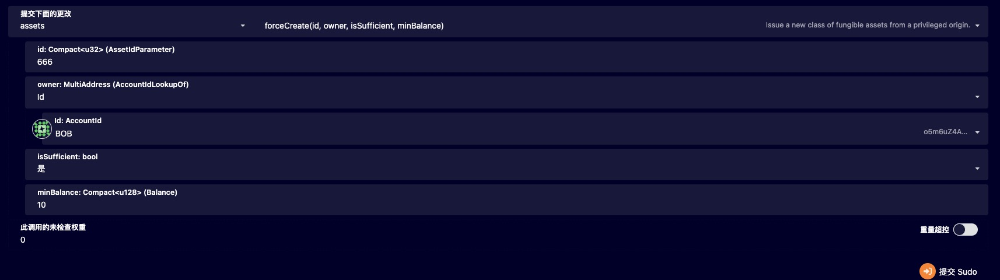
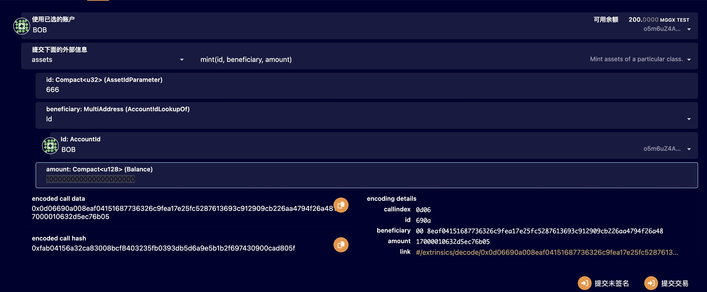
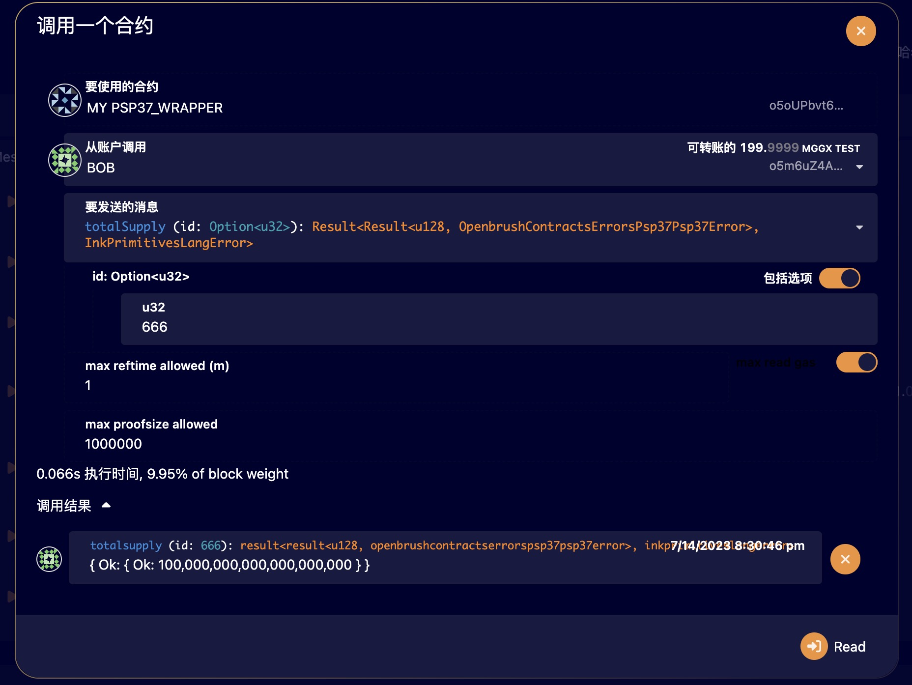
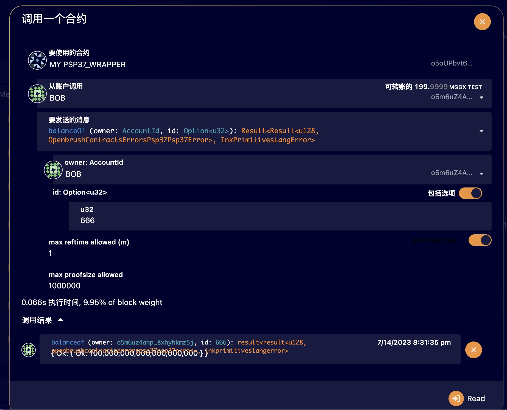
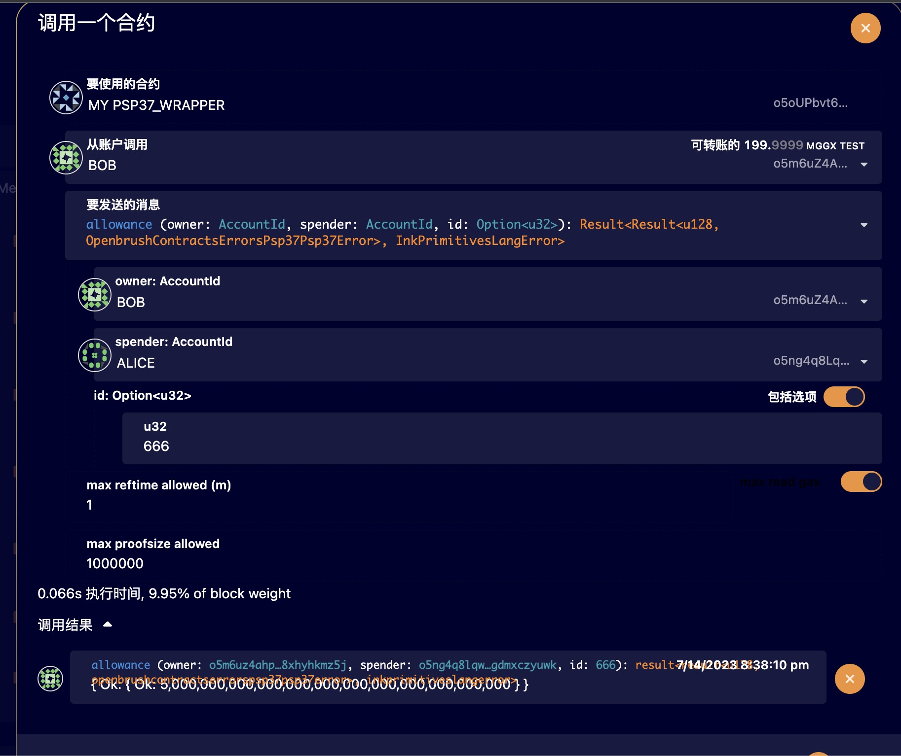
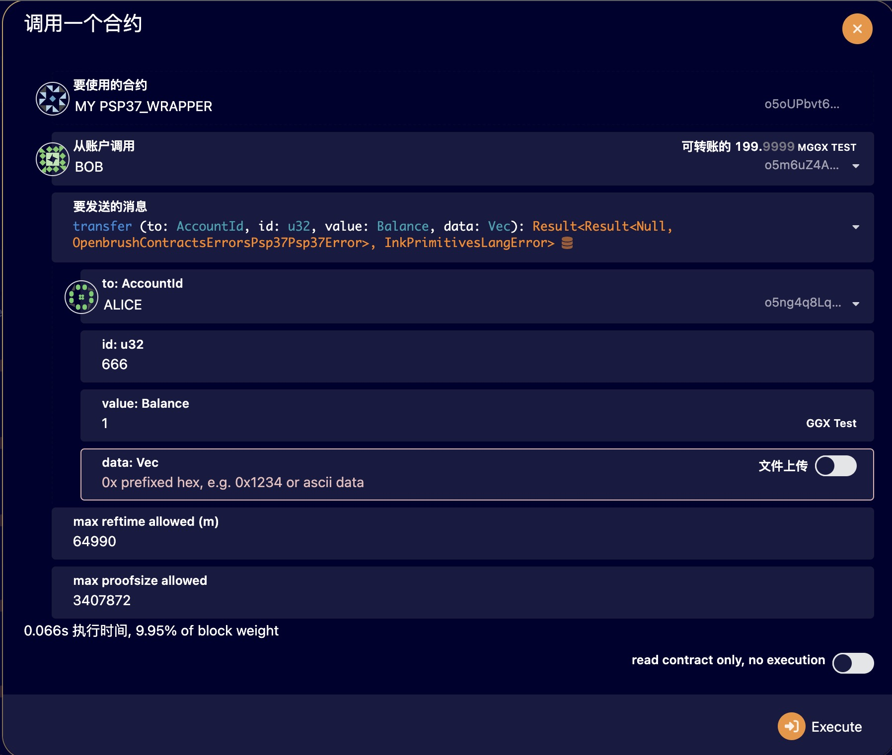
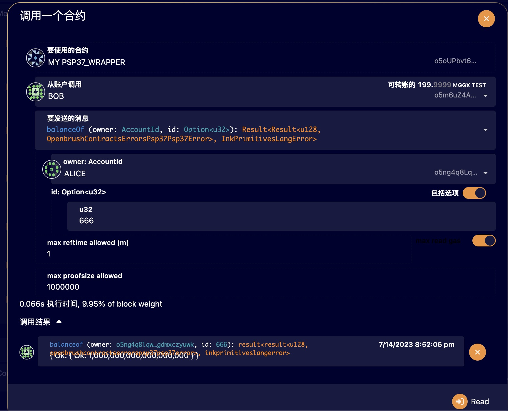

# deploy ink! contract 

```bash
git clone https://github.com/baidang201/ibc.git
cd ics20demo
cargo contract build

open url to deploy ink contract(my_psp37_wrapper.contract) 
https://testnet.sydney.ggxchain.io/?rpc=ws%3A%2F%2F127.0.0.1%3A9944#/contracts
```


# create cross asset on substrate 

```bash
#'{"id":666,"owner":{"Id": "o5m6uZ4AhPCr3rw3obfsgkt5xY6c4bFcZcrQbvc8xhYhkmz5J"},"is_sufficient":true,"min_balance": 10}

open page https://polkadot.js.org/apps/#/sudo

call assets->forceCreate(666, Id/BOB, Yes, 10)
```


# mint token

```bash
open page https://polkadot.js.org/apps/#/extrinsics
call assets->mint(666, Id/BOB, 100000000000000000000)
```

# test total_supply

```
open page https://polkadot.js.org/apps/#/contracts
call psp37_wrapper->totalSupply(666)
```

# test balanceOf

```
open page https://polkadot.js.org/apps/#/contracts
call psp37_wrapper->balanceOf(BOB, 666)
```

# test approve

```
open page https://polkadot.js.org/apps/#/contracts
call psp37_wrapper->approve(BOB, ALICE, 666, 5000000000000000000)
```

# test allowance

```
open page https://polkadot.js.org/apps/#/contracts
call psp37_wrapper->allowance(BOB, ALICE, 666)
```

# test transfer

```
open page https://polkadot.js.org/apps/#/contracts
call psp37_wrapper->transfer(ALICE, 666, 1000000000000000000, None)
```

# test transfer_from

```
open page https://polkadot.js.org/apps/#/contracts
call psp37_wrapper->transferFrom(BOB, ALICE, 666, 1000000000000000000, None)
```

# check alice balance

```
open page https://polkadot.js.org/apps/#/contracts
call psp37_wrapper->balanceOf(ALICE, 666)
```